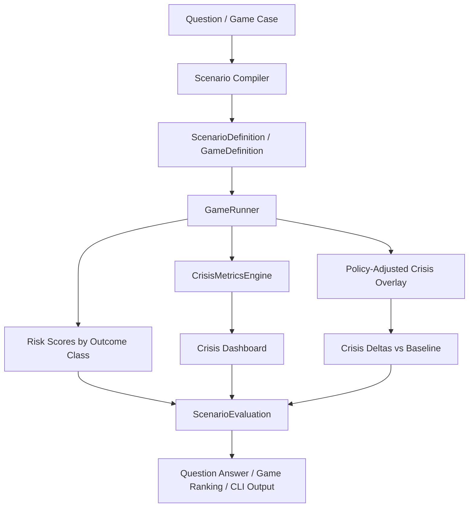

# GIM13

## 1. Что такое GIM_13

`GIM_13` это новый policy-gaming слой над текущим калиброванным миром `GIM_12`.

Его задача:

- принимать вопрос или игровую постановку;
- собирать из нее формальный сценарий;
- считать распределение исходов по классам кризисов и эскалации;
- одновременно считать crisis metrics слой поверх того же состояния мира;
- сравнивать стратегии игроков не только по вероятностям исходов, но и по тому, как они меняют кризисные сигналы.

Важно:

- `GIM_12` остается базовым world core;
- `GIM_13` пока не переписывает физику мира и не делает свой отдельный state transition engine;
- `GIM_13` работает как orchestration + diagnostics + policy gaming слой.

## 2. Состав модулей

| Модуль | Роль |
| :-- | :-- |
| `GIM_13/runtime.py` | Подключает legacy-core `GIM_11_1` и загружает `WorldState` из `GIM_12/agent_states.csv`. |
| `GIM_13/types.py` | Контракты сценариев, игроков, оценок сценария и результата игры. |
| `GIM_13/scenario_library.py` | Библиотека сценарных шаблонов и risk classes. |
| `GIM_13/scenario_compiler.py` | Превращает natural-language question или case file в `ScenarioDefinition` / `GameDefinition`. |
| `GIM_13/crisis_metrics.py` | Отдельный диагностический слой: archetype routing, crisis metrics, global context. |
| `GIM_13/game_runner.py` | Главный движок оценки сценариев и policy gaming. |
| `GIM_13/explanations.py` | Человеко-читаемый вывод для `question`, `game` и `metrics`. |
| `GIM_13/__main__.py` | CLI entrypoint: `question`, `game`, `metrics`. |
| `GIM_13/cases/*.json` | Готовые policy-game кейсы. |
| `tests/*.py` | Smoke и integration tests для сценариев, gaming и crisis metrics. |

## 3. Логика работы нового движка

### 3.1 Поток сверху вниз

### 3.2 Что происходит в `question` режиме

1. Пользовательский вопрос попадает в `scenario_compiler.py`.
2. Компилятор:
   - выбирает template;
   - извлекает базовый год;
   - пытается разрешить акторов;
   - собирает `ScenarioDefinition`.
3. `GameRunner.evaluate_scenario(...)`:
   - считает базовые risk scores по классам исходов;
   - применяет шаблонные shocks;
   - делает `softmax` и получает вероятности сценариев;
   - вызывает `CrisisMetricsEngine`;
   - строит `crisis_dashboard`;
   - возвращает единый `ScenarioEvaluation`.
4. `explanations.py` формирует текст: outcomes, drivers, crisis layer, consistency notes.

В `question` режиме crisis delta обычно равен нулю, потому что нет набора policy actions для сравнительного overlay.

### 3.3 Что происходит в `game` режиме

1. `scenario_compiler.py` читает case JSON и собирает `GameDefinition`.
2. `GameRunner.run_game(...)`:
   - считает baseline evaluation без действий;
   - строит все комбинации допустимых действий игроков;
   - для каждой комбинации считает:
     - distribution of outcomes;
     - crisis dashboard;
     - crisis delta vs baseline;
     - payoffs игроков.
3. Комбинации сортируются по total payoff.
4. `explanations.py` показывает:
   - лучший strategy profile;
   - top outcomes;
   - crisis delta vs baseline;
   - top strategy profiles;
   - baseline top outcomes.

## 4. Сценарный слой

### 4.1 Базовые outcome classes

Сейчас движок ранжирует как минимум такие классы исходов:

- `status_quo`
- `controlled_suppression`
- `internal_destabilization`
- `limited_proxy_escalation`
- `maritime_chokepoint_crisis`
- `direct_strike_exchange`
- `broad_regional_escalation`
- `negotiated_deescalation`

### 4.2 Откуда берутся вероятности

`game_runner.py` строит агрегированный actor profile по scenario actors:

- `debt_stress`
- `social_stress`
- `resource_gap`
- `energy_dependence`
- `conflict_stress`
- `sanctions_pressure`
- `military_posture`
- `climate_stress`
- `policy_space`
- `negotiation_capacity`
- `tail_pressure`

После этого формируются raw risk scores:

- status quo;
- internal destabilization;
- proxy escalation;
- maritime crisis;
- direct strike;
- broad regional escalation;
- negotiated de-escalation.

Потом:

1. добавляются template-specific biases;
2. добавляются action shifts;
3. добавляется tail-risk expansion;
4. применяется `softmax`.

Итогом становится `risk_probabilities`.

## 5. Crisis Metrics Layer

`CrisisMetricsEngine` это отдельный диагностический слой, который не мутирует мир и не подменяет собой core simulation.

На входе:

- `WorldState`;
- `AgentState`;
- relations;
- optional short history.

На выходе:

- `GlobalCrisisContext`;
- `AgentCrisisReport`;
- `CrisisDashboard`.

### 5.1 Схема одной метрики

Каждая кризисная метрика хранит:

- `value`
- `unit`
- `level`
- `momentum`
- `buffer`
- `trigger`
- `severity`
- `relevance`
- `threshold_flag`
- `contributors`

Смысл полей:

- `value` это сырое значение;
- `level` это нормализованный текущий уровень риска;
- `momentum` это краткосрочный сдвиг;
- `buffer` это запас устойчивости;
- `trigger` это близость к переходу в кризисный режим;
- `severity` это агрегированный risk score метрики;
- `relevance` это вес метрики для данного архетипа;
- `contributors` объясняют, почему метрика выросла или снизилась.

### 5.2 Global metrics

Сейчас глобальный dashboard включает:

- `global_oil_market_stress`
- `global_energy_volume_gap`
- `global_sanctions_footprint`
- `global_trade_fragmentation`

Логика:

- сначала считается мировое предложение и спрос на энергию;
- затем строится proxy oil benchmark;
- затем оценивается плотность санкций и средняя торговая фрагментация мира.

### 5.3 Agent metrics

Сейчас для агента считаются:

- `inflation`
- `oil_vulnerability`
- `fx_stress`
- `sovereign_stress`
- `food_affordability_stress`
- `protest_pressure`
- `regime_fragility`
- `sanctions_strangulation`
- `conflict_escalation_pressure`
- `strategic_dependency`
- `chokepoint_exposure`

### 5.4 Приближенные формулы

Ниже не код, а смысл вычислений.

#### `inflation`

Строится как:

- базовая инфляция из состояния агента;
- plus energy pass-through;
- plus food pass-through;
- plus metals pass-through;
- plus sanctions / barrier pass-through.

#### `oil_vulnerability`

Строится как:

- import dependence по энергии;
- days of cover;
- route pressure;
- для экспортера дополнительно price-and-route exposure по экспортной стороне.

#### `fx_stress`

Строится как:

- proxy monthly import bill;
- FX reserves / monthly imports;
- import compression pressure.

#### `sovereign_stress`

Строится как функция из:

- debt / GDP;
- effective interest rate;
- interest / revenue;
- FX stress.

#### `food_affordability_stress`

Строится из:

- food gap;
- basket price;
- income buffer;
- food cover.

#### `protest_pressure`

Строится из:

- core protest risk;
- inflation pressure;
- unemployment;
- food stress;
- trust erosion.

#### `regime_fragility`

Строится из:

- regime stability;
- trust;
- social tension;
- protest pressure;
- sanctions strain.

#### `sanctions_strangulation`

Строится из:

- числа активных санкций;
- trade barriers;
- падения trade intensity;
- FX stress.

#### `conflict_escalation_pressure`

Строится из:

- average conflict;
- inverse trust;
- hawkishness;
- military power;
- war links;
- санкционного давления.

#### `strategic_dependency`

Строится из:

- gaps по energy / food / metals;
- reserve stress;
- thin buffers.

#### `chokepoint_exposure`

Это пока proxy-метрика, которая использует:

- energy import dependence;
- trade openness;
- regional route risk;
- global oil stress.

## 6. Archetype Router

Не все кризисы одинаково релевантны для всех стран.

Поэтому после расчета базовых метрик `CrisisMetricsEngine` определяет archetype агента:

- `advanced_service_democracy`
- `developing_importer`
- `hydrocarbon_exporter`
- `industrial_power`
- `fragile_conflict_state`
- `mixed_emerging`

И применяет relevance weights.

Примеры:

- для `advanced_service_democracy` food stress считается, но обычно имеет низкий relevance;
- для `developing_importer` высокие веса получают `inflation`, `fx_stress`, `food_affordability_stress`;
- для `hydrocarbon_exporter` растет relevance у `oil_vulnerability`, `sanctions_strangulation`, `chokepoint_exposure`;
- для `industrial_power` особенно важны `strategic_dependency`, `sanctions_strangulation`, `conflict_escalation_pressure`.

Это решает проблему "один список кризисов для всех".

## 7. Как crisis metrics встроены в `ScenarioEvaluation`

Теперь `ScenarioEvaluation` содержит не только:

- `risk_probabilities`;
- `driver_scores`;
- `dominant_outcomes`;
- `criticality_score`.

Он также содержит:

- `crisis_dashboard`
- `crisis_delta_by_agent`
- `crisis_signal_summary`

### 7.1 `crisis_dashboard`

Это текущий dashboard кризисных метрик для scenario actors и глобального контекста.

### 7.2 `crisis_delta_by_agent`

Это сравнение baseline crisis dashboard с policy-adjusted dashboard.

Для каждой метрики хранятся:

- `level_delta`
- `severity_delta`
- `weighted_shift`

Есть также служебный блок `__global__` для глобальных метрик.

### 7.3 `crisis_signal_summary`

Это агрегированный summary по основным направлениям:

- `net_crisis_shift`
- `macro_stress_shift`
- `stability_stress_shift`
- `geopolitical_stress_shift`
- `global_context_shift`
- `worst_actor_shift`

## 8. Policy-adjusted crisis overlay

Ключевая новая часть `GIM_13` это то, что strategy actions влияют не только на outcome classes, но и на crisis metrics.

Для этого в `game_runner.py` есть отдельная карта `ACTION_CRISIS_SHIFTS`.

Примеры:

- `maritime_interdiction` повышает:
  - `global_oil_market_stress`
  - `global_energy_volume_gap`
  - `oil_vulnerability`
  - `chokepoint_exposure`
  - `inflation`
- `accept_mediation` понижает:
  - `conflict_escalation_pressure`
  - `sanctions_strangulation`
  - `global_trade_fragmentation`
  - `global_oil_market_stress`
- `domestic_crackdown` повышает:
  - `regime_fragility`
  - `protest_pressure`
  - `sanctions_strangulation`

Это важно, потому что теперь policy game оценивает не только "какой outcome class стал вероятнее", но и "через какие кризисные каналы стратегия ухудшает или улучшает ситуацию".

## 9. Как actions влияют на payoff

Раньше payoff строился в основном из:

- distribution of outcomes;
- objective-specific utilities;
- action bonus;
- calibration / consistency penalties.

Теперь добавлен и crisis-aware слой:

- `OBJECTIVE_TO_CRISIS_UTILITY`
- `OBJECTIVE_TO_GLOBAL_CRISIS_UTILITY`

Примеры:

- `regime_retention` штрафуется за рост `regime_fragility` и `protest_pressure`;
- `reduce_war_risk` штрафуется за рост `conflict_escalation_pressure` и `geopolitical_stress_shift`;
- `resource_access` штрафуется за рост `oil_vulnerability`, `strategic_dependency`, `chokepoint_exposure`;
- `sanctions_resilience` штрафуется за `sanctions_strangulation`, `fx_stress`, `sovereign_stress`.

Итог:

- стратегия может выглядеть выгодно по outcome probability;
- но если она резко ухудшает crisis layer, ее общий payoff падает.

## 10. Что показывает CLI

### `python3 -m GIM_13 question ...`

Показывает:

- top outcomes;
- strongest drivers;
- crisis layer summary;
- top crisis metrics по агентам;
- consistency notes.

### `python3 -m GIM_13 game --case ...`

Показывает:

- лучший strategy profile;
- top outcomes;
- `crisis delta vs baseline`;
- largest metric shifts;
- top strategy profiles;
- baseline top outcomes.

### `python3 -m GIM_13 metrics --agents ...`

Показывает:

- global crisis context;
- archetype каждого агента;
- top relevant crisis metrics по каждому агенту.

## 11. Ограничения текущей версии

### 11.1 Это еще не полный subannual simulator

`GIM_13` пока не заменяет annual core `GIM_12`.

Сейчас:

- `GIM_12` это годовой core;
- `GIM_13` это orchestration, diagnostics и policy-gaming слой;
- crisis metrics могут давать более частый reporting layer, но не делают core автоматически quarterly.

См. `GIM_12_quarterly_readiness.md`.

### 11.2 Некоторые метрики пока proxy

Особенно:

- `global_oil_market_stress`
- `chokepoint_exposure`
- route-sensitive volume metrics

Они уже полезны как policy-gaming diagnostics, но позже потребуют более богатого route / logistics / shock graph.

### 11.3 Crisis overlay пока не прогоняет реальный `step_world`

Сейчас policy actions изменяют crisis layer через overlay, а не через полноценную прогонку отдельного substep engine.

Это осознанный MVP-компромисс:

- быстро;
- объяснимо;
- не ломает калибровку `GIM_12`;
- но это еще не финальный multi-scale simulator.

## 12. Что делать дальше

Самый логичный следующий шаг:

1. Связать crisis metrics с реальным `step_world` или substep runner.
2. Ввести `FactionState` и proxy-layer.
3. Добавить историческую память metric deltas на `1/3/12` шагов.
4. Сделать полноценный crisis ontology и LLM-driven tail risk proposals.
5. Перейти от annual core к `dt_years` и multi-scale time.

## 13. Короткий вывод

Текущее состояние `GIM_13`:

- есть scenario compiler;
- есть policy game runner;
- есть crisis metrics layer;
- есть crisis-aware evaluation;
- есть crisis-aware payoff logic;
- есть CLI и тесты.

То есть `GIM_13` уже не просто "обертка над симулятором", а рабочий policy-gaming и crisis diagnostics движок поверх калиброванного мира `GIM_12`.
