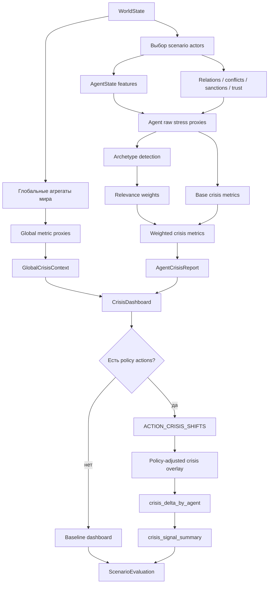
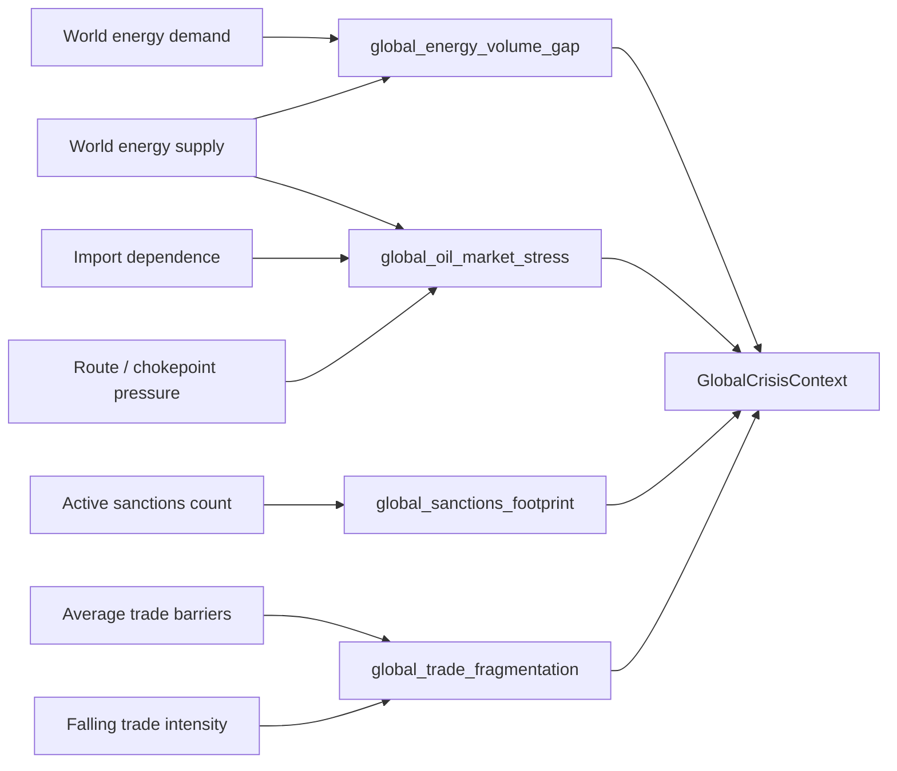
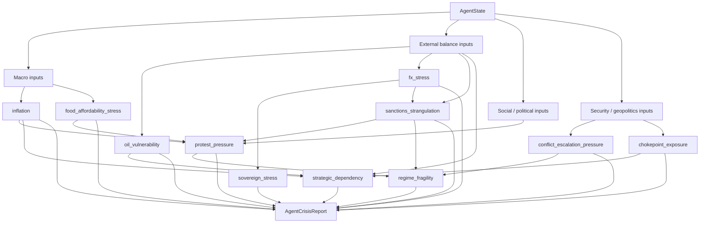
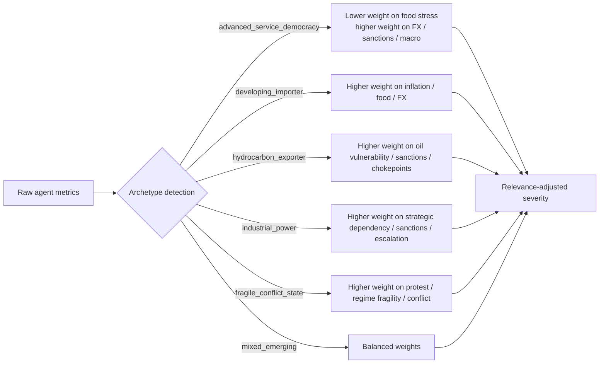
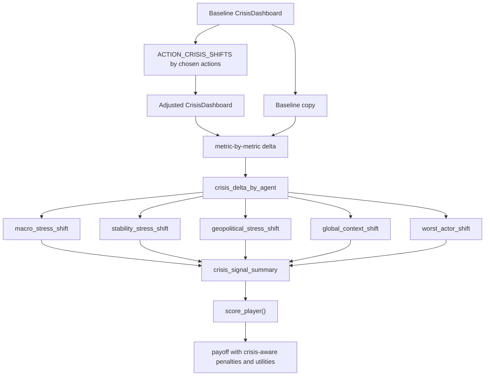

# GIM_13 Crisis Metrics Flow

Ниже отдельная схема того, как работает `crisis metric layer`: что он берет на вход, какие прокси считает, как строит агентские и глобальные метрики и как они затем попадают в `ScenarioEvaluation`.

## 1. Общий поток crisis layer

## 2. Глобальные метрики

## 3. Агентские метрики и связи между ними

## 4. Приближенные формулы

Это не буквальный код, а логика сборки прокси.

```mermaid
flowchart TD
    A["inflation"] --> A1["base inflation"]
    A --> A2["+ energy pass-through"]
    A --> A3["+ food pass-through"]
    A --> A4["+ metals pass-through"]
    A --> A5["+ sanctions / barriers"]

    B["oil_vulnerability"] --> B1["energy import dependence"]
    B --> B2["+ inventory cover pressure"]
    B --> B3["+ route / chokepoint pressure"]
    B --> B4["+ export-side route exposure for exporters"]

    C["fx_stress"] --> C1["monthly import bill proxy"]
    C --> C2["+ reserve adequacy gap"]
    C --> C3["+ import compression pressure"]

    D["sovereign_stress"] --> D1["debt / GDP"]
    D --> D2["+ interest burden"]
    D --> D3["+ fiscal strain"]
    D --> D4["+ fx_stress spillover"]

    E["food_affordability_stress"] --> E1["food gap"]
    E --> E2["+ basket price pressure"]
    E --> E3["+ weak household income buffer"]
    E --> E4["+ low food cover"]

    F["protest_pressure"] --> F1["core protest risk"]
    F --> F2["+ inflation"]
    F --> F3["+ unemployment / social tension"]
    F --> F4["+ food stress"]
    F --> F5["+ trust erosion"]

    G["regime_fragility"] --> G1["baseline regime stability inverse"]
    G --> G2["+ protest_pressure"]
    G --> G3["+ trust erosion"]
    G --> G4["+ sanctions strain"]

    H["sanctions_strangulation"] --> H1["active sanctions"]
    H --> H2["+ trade barriers"]
    H --> H3["+ low trade intensity"]
    H --> H4["+ fx_stress"]

    I["conflict_escalation_pressure"] --> I1["conflict links"]
    I --> I2["+ hawkishness"]
    I --> I3["+ military posture"]
    I --> I4["+ sanctions pressure"]
    I --> I5["+ low trust"]

    J["strategic_dependency"] --> J1["energy gap"]
    J --> J2["+ food gap"]
    J --> J3["+ metals gap"]
    J --> J4["+ reserve stress"]
    J --> J5["+ thin buffers"]

    K["chokepoint_exposure"] --> K1["import dependence"]
    K --> K2["+ trade openness"]
    K --> K3["+ route risk proxy"]
    K --> K4["+ global oil stress"]
```

## 5. Archetype router

## 6. Как crisis layer входит в policy gaming

## 7. Как читать этот слой

- crisis layer не подменяет `step_world`, а диагностирует и ранжирует кризисные каналы поверх baseline мира;
- одна и та же стратегия может улучшать outcome probability, но ухудшать crisis metrics и поэтому терять payoff;
- глобальные метрики задают фон, агентские метрики показывают конкретные каналы уязвимости;
- archetype router нужен для того, чтобы не сравнивать страны по одному и тому же весовому шаблону;
- текущая версия это explainable proxy-layer, который сохраняет совместимость с калибровкой `GIM_12`.
