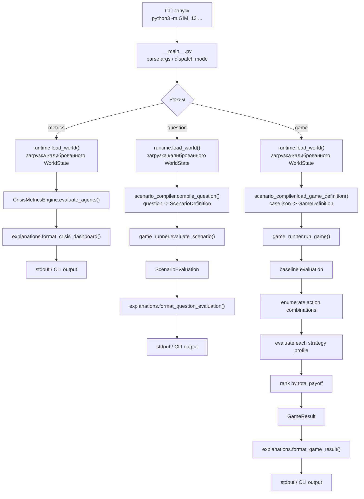
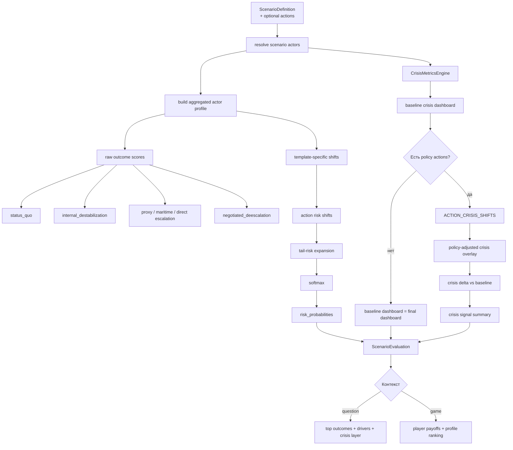
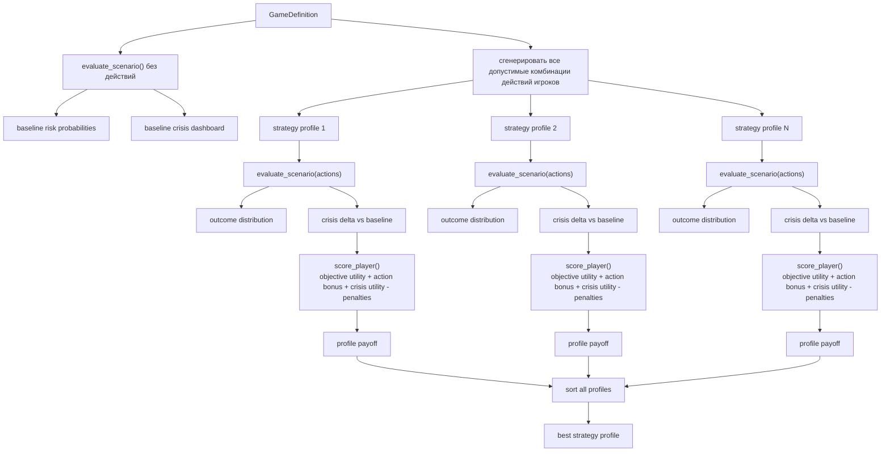

# GIM_13 Simulation Flow

Ниже вынесена отдельная блок-схема того, что происходит при запуске `GIM_13` и как внутри собирается итоговая оценка сценария.

## 1. Общий контур запуска

## 2. Внутренняя логика оценки сценария

## 3. Детализация `game` режима

## 4. Как читать схему

- `runtime.py` только поднимает калиброванный мир и не меняет физику legacy-core.
- `scenario_compiler.py` превращает вопрос или JSON-case в формальную постановку.
- `game_runner.py` считает одновременно два слоя: outcome layer и crisis layer.
- `crisis_metrics.py` дает диагностический слой по глобальным и агентским метрикам.
- `ACTION_CRISIS_SHIFTS` меняет не мир напрямую, а crisis overlay поверх baseline dashboard.
- В `game` режиме стратегия выигрывает только если дает приемлемый outcome и не слишком ухудшает crisis metrics.
