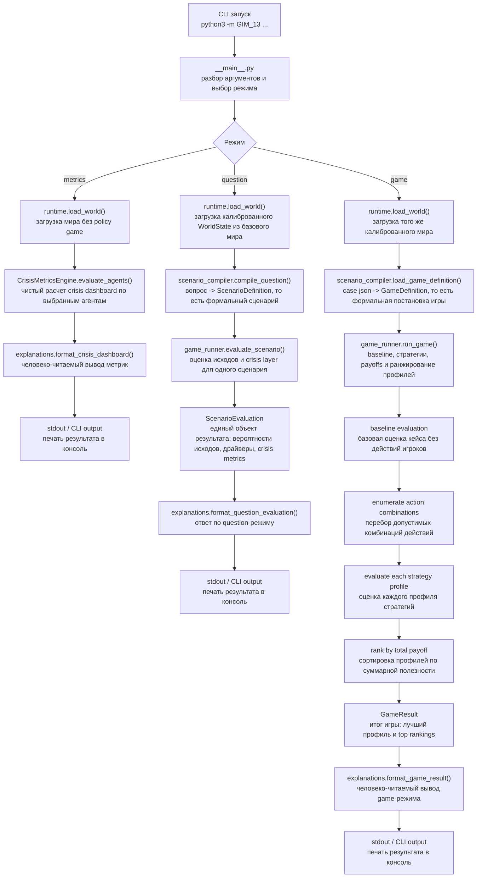
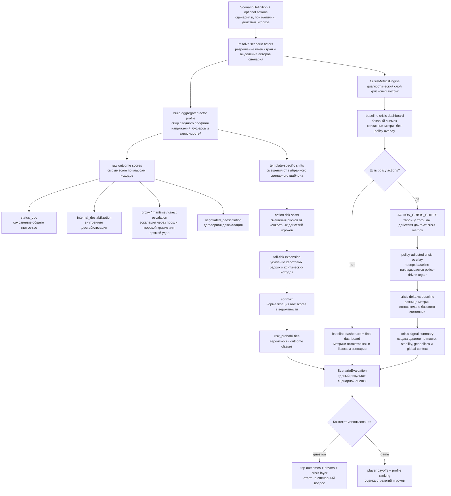
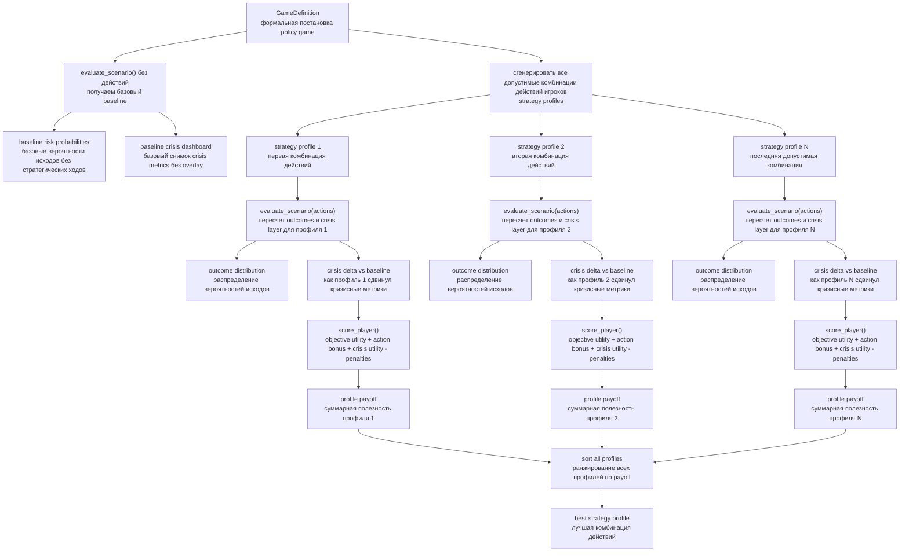

# GIM_13 Simulation Flow

Ниже вынесена блок-схема того, что происходит при запуске `GIM_13`, как он опирается на годовой core `GIM_12`, и как внутри собирается итоговая оценка сценария. Явные технические названия в узлах сразу сопровождаются короткой расшифровкой.

## 0. Как работает годовой шаг `GIM_12`

`GIM_13` не заменяет legacy-core, поэтому сначала важно видеть реальную последовательность одного шага базовой симуляции `GIM_12`.

```mermaid
flowchart TD
    A["Старт шага GIM_12<br/>вход: калиброванный WorldState за год t"] --> B["compute_relative_metrics()<br/>пересчет сравнительных метрик стран и двусторонних отношений"]
    B --> C["update_political_states()<br/>обновление политического состояния, доверия, напряжения, санкционного контекста"]
    C --> D["update_institutions()<br/>международные институты и их корректирующие меры"]
    D --> E["Генерация действий агентов<br/>policy(obs) -> Action для каждой страны"]
    E --> F["apply_political_constraints()<br/>фильтр: что политически допустимо исполнить"]
    F --> G["resolve_foreign_policy()<br/>сведение внешнеполитических намерений в совместимый набор действий"]
    G --> H["apply_sanctions_effects() + apply_security_actions()<br/>санкции, силовые действия и их прямые эффекты"]
    H --> I["update_active_conflicts() + apply_trade_barrier_effects()<br/>эскалация конфликтов и торговые барьеры"]
    I --> J["apply_action() + apply_trade_deals()<br/>внедрение внутренних и внешних политик в состояние мира"]
    J --> K["update_relations_endogenous()<br/>эндогенное обновление отношений после действий"]
    K --> L["allocate_energy_reserves_and_caps()<br/>распределение энергии, резервов и production caps"]
    L --> M["update_resource_stocks() + update_global_resource_prices()<br/>ресурсы, дефициты и мировые цены"]
    M --> N["update_global_climate() + update_climate_risks()<br/>климатический фон и риски"]
    N --> O["apply_climate_extreme_events()<br/>экстремальные климатические события, если включены"]
    O --> P["update_economy_output()<br/>выпуск, капитал, TFP, климатические потери"]
    P --> Q["update_public_finances() + check_debt_crisis()<br/>бюджет, долг и проверка долгового кризиса"]
    Q --> R["update_migration_flows()<br/>межстрановая миграция"]
    R --> S["update_population() + update_social_state()<br/>демография, протесты, социальное напряжение"]
    S --> T["check_regime_stability()<br/>проверка устойчивости режима"]
    T --> U["compute_relative_metrics()<br/>повторный пересчет сравнительных метрик на новом состоянии"]
    U --> V["update_agent_memory() + update_credit_ratings()<br/>память агентов и кредитный риск на следующий год"]
    V --> W["world.time += 1<br/>завершение шага: t -> t + 1"]
```

### Подсказки к названиям в шаге `GIM_12`

- `WorldState`: полный снимок мира на начало шага, включая страны, отношения, ресурсы и климат.
- `Observation`: то, что агент видит перед выбором своей политики.
- `Action`: формализованный пакет решений агента на один шаг.
- `policy(obs)`: функция политики, которая получает наблюдение и возвращает действие агента.
- `Political constraints`: ограничения, которые не дают агенту исполнить политически нереалистичное действие.
- `Production caps`: годовые ограничения на добычу и поставку ресурсов.
- `TFP`: total factor productivity, то есть технологическая/организационная эффективность экономики.
- `Agent memory`: краткая память о прошлых шагах, которую используют политики и кредитный слой.
- `Credit ratings`: оценка долговой и политической уязвимости на следующий год.

## 1. Общий контур запуска `GIM_13`

## 2. Внутренняя логика оценки сценария

## 3. Детализация `game` режима

## 4. Словарь терминов на схемах

- `ScenarioDefinition`: формализованный сценарий, собранный из вопроса, года, акторов и выбранного шаблона.
- `GameDefinition`: формализованная игровая постановка, где уже заданы игроки, их действия и цели.
- `ScenarioEvaluation`: итог оценки одного сценария, включающий вероятности исходов, драйверы и crisis layer.
- `GameResult`: итог policy game после сравнения всех допустимых профилей стратегий.
- `Baseline evaluation`: оценка кейса без действий игроков; нужна как точка сравнения.
- `Baseline crisis dashboard`: базовый crisis snapshot без наложения policy-driven shifts.
- `ACTION_CRISIS_SHIFTS`: словарь правил, который задает, какие именно crisis metrics меняет каждое действие.
- `Policy-adjusted crisis overlay`: слой сдвигов поверх baseline dashboard, не изменяющий сам legacy-world напрямую.
- `Crisis delta vs baseline`: разница между baseline dashboard и dashboard после выбранной стратегии.
- `Crisis signal summary`: агрегированная сводка по крупным осям риска, например `macro_stress_shift` и `geopolitical_stress_shift`.
- `Payoff`: суммарная полезность стратегии с учетом outcome probabilities, целей игрока и кризисных штрафов.
- `Outcome distribution`: вероятностное распределение по классам исходов, а не один жестко выбранный результат.
- `Objective utility`: полезность исхода с точки зрения явной цели игрока, например `regime_retention` или `reduce_war_risk`.
- `Action bonus`: небольшой дополнительный бонус за действие, которое содержательно соответствует цели игрока.
- `Crisis utility`: вклад crisis metrics в payoff, то есть штрафы или бонусы за изменение кризисных сигналов.
- `Penalties`: штрафы за неконсистентность, чрезмерный tail-risk или нарушение калибровочных ожиданий.

## 5. Как читать схему

- `runtime.py` только поднимает калиброванный мир и не меняет физику legacy-core.
- `GIM_12` по-прежнему делает годовой state transition, а `GIM_13` строит orchestration, diagnostics и policy gaming поверх него.
- `scenario_compiler.py` превращает вопрос или JSON-case в формальную постановку.
- `game_runner.py` считает одновременно два слоя: outcome layer и crisis layer.
- `crisis_metrics.py` дает explainable слой глобальных и агентских метрик.
- `ACTION_CRISIS_SHIFTS` меняет не сам `WorldState`, а диагностический overlay поверх baseline dashboard.
- В `game` режиме стратегия выигрывает только если дает приемлемый outcome и не слишком ухудшает crisis metrics.
