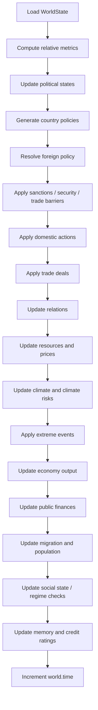

# GIM_14

`GIM_14` is the new local primary working repository for the simulator.

It unifies the active yearly simulation core from `GIM_11_1` with the current compiled state and source-data pipeline that had been living in `GIM_12`. The goal of this repo is to become the clean working line for the next calibration and restructuring passes without deleting or rewriting the older version folders.

Important scope note:

- this repository already contains the active simulation engine, compiled state, pipeline inputs, map assets, and runnable CLI
- this repository does not yet include the full `GIM_13` scenario/game layer
- the calibration documents from the `GIM_13` line are carried forward here as migration references, so the next calibration work can continue on top of `GIM_14`

## 1. What The Model Can Do

`GIM_14` currently supports the following core capabilities:

- load a compiled multi-country world state from [data/agent_states.csv](/Users/theclimateguy/Documents/jupyter_lab/GIM_14/data/agent_states.csv)
- validate the state CSV before simulation via [world_factory.py](/Users/theclimateguy/Documents/jupyter_lab/GIM_14/gim/core/world_factory.py)
- run yearly simulations with endogenous updates to economy, resources, climate, geopolitics, politics, society, institutions, and creditworthiness
- choose between `simple`, `growth`, `llm`, and `auto` policy modes through the CLI and env vars
- generate detailed CSV logs of world trajectories, agent actions, and institution activity
- render an offline Leaflet credit-risk map from simulation logs
- rebuild and audit the compiled state inputs using the bundled source-data pipeline in [data/agent_state_pipeline](/Users/theclimateguy/Documents/jupyter_lab/GIM_14/data/agent_state_pipeline)
- serve as the clean migration base for the next calibration round

## 2. Repository Layout

```text
GIM_14/
├── gim/
│   ├── __init__.py
│   ├── __main__.py
│   ├── paths.py
│   └── core/
├── data/
├── docs/
├── scripts/
├── tests/
├── vendor/
├── CALIBRATION_REFERENCE.md
├── CALIBRATION_LAYER.md
├── pyproject.toml
└── README.md
```

Main areas:

- [gim/](/Users/theclimateguy/Documents/jupyter_lab/GIM_14/gim) is the installable Python package
- [gim/core/](/Users/theclimateguy/Documents/jupyter_lab/GIM_14/gim/core) is the active yearly simulation engine
- [data/](/Users/theclimateguy/Documents/jupyter_lab/GIM_14/data) holds the compiled state, raw pipeline cache, generated panels, and map geometry
- [scripts/](/Users/theclimateguy/Documents/jupyter_lab/GIM_14/scripts) holds helper scripts for state building, map rendering, and long runs
- [docs/](/Users/theclimateguy/Documents/jupyter_lab/GIM_14/docs) holds migration notes plus imported methodology snapshots
- [tests/](/Users/theclimateguy/Documents/jupyter_lab/GIM_14/tests) holds the current smoke/health checks for the new repo

## 3. System View

### 3.1 High-Level Architecture


This is the key architectural change in `GIM_14`: the simulation core and the active data stack now sit in one clean repo instead of being split across version-numbered folders with inverted dependencies.

### 3.2 Yearly Simulation Loop



## 4. Core Modules

| Module | Role |
| --- | --- |
| [gim/core/cli.py](/Users/theclimateguy/Documents/jupyter_lab/GIM_14/gim/core/cli.py) | Main CLI entrypoint and run orchestration. |
| [gim/core/world_factory.py](/Users/theclimateguy/Documents/jupyter_lab/GIM_14/gim/core/world_factory.py) | CSV validation and `WorldState` construction. |
| [gim/core/simulation.py](/Users/theclimateguy/Documents/jupyter_lab/GIM_14/gim/core/simulation.py) | The yearly world-step loop. |
| [gim/core/policy.py](/Users/theclimateguy/Documents/jupyter_lab/GIM_14/gim/core/policy.py) | Policy mode resolution, LLM integration, and baseline policy heuristics. |
| [gim/core/actions.py](/Users/theclimateguy/Documents/jupyter_lab/GIM_14/gim/core/actions.py) | Domestic actions, trade deals, and direct policy application. |
| [gim/core/economy.py](/Users/theclimateguy/Documents/jupyter_lab/GIM_14/gim/core/economy.py) | GDP, TFP, capital, debt, and public-finance dynamics. |
| [gim/core/climate.py](/Users/theclimateguy/Documents/jupyter_lab/GIM_14/gim/core/climate.py) | Emissions intensity, carbon cycle, forcing, temperature, and climate risks. |
| [gim/core/social.py](/Users/theclimateguy/Documents/jupyter_lab/GIM_14/gim/core/social.py) | Population, migration, trust, inequality, and regime dynamics. |
| [gim/core/geopolitics.py](/Users/theclimateguy/Documents/jupyter_lab/GIM_14/gim/core/geopolitics.py) | Sanctions, security actions, and conflict propagation. |
| [gim/core/political_dynamics.py](/Users/theclimateguy/Documents/jupyter_lab/GIM_14/gim/core/political_dynamics.py) | Endogenous relation updates, coalitions, and trade-barrier logic. |
| [gim/core/resources.py](/Users/theclimateguy/Documents/jupyter_lab/GIM_14/gim/core/resources.py) | Resource production, consumption, depletion, and global pricing. |
| [gim/core/institutions.py](/Users/theclimateguy/Documents/jupyter_lab/GIM_14/gim/core/institutions.py) | International institution updates and reports. |
| [gim/core/credit_rating.py](/Users/theclimateguy/Documents/jupyter_lab/GIM_14/gim/core/credit_rating.py) | Yearly sovereign-style credit scoring and zones. |
| [gim/core/logging_utils.py](/Users/theclimateguy/Documents/jupyter_lab/GIM_14/gim/core/logging_utils.py) | Trajectory, action, and institution CSV logging. |
| [scripts/build_gim13_agent_states.py](/Users/theclimateguy/Documents/jupyter_lab/GIM_14/scripts/build_gim13_agent_states.py) | Current compiled-state build pipeline script carried over from `GIM_12`. |
| [scripts/credit_map_leaflet.py](/Users/theclimateguy/Documents/jupyter_lab/GIM_14/scripts/credit_map_leaflet.py) | Offline credit-map generator. |

## 5. Runtime Behavior

### 5.1 Entrypoints

Main entrypoint:

```bash
python3 -m gim
```

Helper script for 10-year LLM-backed runs:

```bash
./scripts/run_10y_llm.sh
```

### 5.2 Policy Modes

The simulator supports four policy modes:

- `simple`: deterministic baseline rule-based policies
- `growth`: deterministic growth-seeking policies
- `llm`: direct LLM-backed country policies
- `auto`: use `llm` only if runtime prerequisites are present, otherwise fall back automatically

### 5.3 Main Environment Variables

| Variable | Purpose | Default |
| --- | --- | --- |
| `STATE_CSV` | Path to input state CSV | [data/agent_states.csv](/Users/theclimateguy/Documents/jupyter_lab/GIM_14/data/agent_states.csv) |
| `MAX_COUNTRIES` | Country limit loaded from CSV | `100` |
| `SIM_YEARS` | Simulation horizon in years | `5` in CLI, `10` in helper script |
| `POLICY_MODE` | `auto|simple|growth|llm` | `auto` |
| `DEEPSEEK_API_KEY` | Required for `llm` mode | unset |
| `LLM_MAX_CONCURRENCY` | Parallel LLM worker count | `12` |
| `LLM_BATCH_SIZE` | Batch size for async policy calls | `20` |
| `SAVE_CSV_LOGS` | Write simulation logs | `0` in smoke-style runs |
| `GENERATE_CREDIT_MAP` | Build offline HTML map from logs | `1` |
| `SIM_SEED` | Random seed | unset |
| `DISABLE_EXTREME_EVENTS` | Disable endogenous climate extreme events | unset |

## 6. Data Layer

The active data layer has two parts:

1. compiled runtime state
2. source-data pipeline

Compiled runtime state:

- [data/agent_states.csv](/Users/theclimateguy/Documents/jupyter_lab/GIM_14/data/agent_states.csv)

Source-data pipeline:

- [data/agent_state_pipeline/generated/actor_base_inputs.csv](/Users/theclimateguy/Documents/jupyter_lab/GIM_14/data/agent_state_pipeline/generated/actor_base_inputs.csv)
- [data/agent_state_pipeline/generated/country_panel_raw.csv](/Users/theclimateguy/Documents/jupyter_lab/GIM_14/data/agent_state_pipeline/generated/country_panel_raw.csv)
- [data/agent_state_pipeline/generated/country_panel_imputed.csv](/Users/theclimateguy/Documents/jupyter_lab/GIM_14/data/agent_state_pipeline/generated/country_panel_imputed.csv)
- [docs/agent_state_data_contract.md](/Users/theclimateguy/Documents/jupyter_lab/GIM_14/docs/agent_state_data_contract.md)

The naming of [scripts/build_gim13_agent_states.py](/Users/theclimateguy/Documents/jupyter_lab/GIM_14/scripts/build_gim13_agent_states.py) is historical and will likely be cleaned up in a later pass, but the actual pipeline artifacts now live inside `GIM_14`.

## 7. Outputs

When logging is enabled, the model writes:

- world trajectory CSVs
- action logs
- institution logs
- optional offline credit map HTML

Logs are written into `logs/` under the repo root.

## 8. Calibration Documents

Calibration continuity from the `GIM_13` line is preserved here through:

- [CALIBRATION_REFERENCE.md](/Users/theclimateguy/Documents/jupyter_lab/GIM_14/CALIBRATION_REFERENCE.md)
- [CALIBRATION_LAYER.md](/Users/theclimateguy/Documents/jupyter_lab/GIM_14/CALIBRATION_LAYER.md)

These files are intentionally carried forward so the next calibration work can continue from the existing world-physics and policy-calibration thinking, even though the full `GIM_13` game/scenario runtime has not yet been ported into `GIM_14`.

## 9. Testing

The current `GIM_14` health checks are in [tests/test_smoke.py](/Users/theclimateguy/Documents/jupyter_lab/GIM_14/tests/test_smoke.py).

Run them with:

```bash
cd /Users/theclimateguy/Documents/jupyter_lab/GIM_14
python3 -m unittest discover -s tests -v
```

At the moment the suite verifies:

- default state availability
- successful world loading
- successful one-step simulation
- successful CLI smoke execution

## 10. Migration Status

`GIM_14` is now the clean working base for the next phase, but not the end-state architecture yet.

Already done:

- active core moved into a single installable package
- active data/pipeline assets copied into the new repo
- old archive ballast excluded from the new repo
- CLI paths and helper scripts rewired to the new layout
- smoke tests added and passing

Still expected later:

- port the `GIM_13` scenario/game layer if we still want that surface in `GIM_14`
- port the richer calibration harnesses and historical backtests from the `GIM_13` line
- clean historical names such as `build_gim13_agent_states.py`
- expand tests beyond smoke checks into structural regression tests

