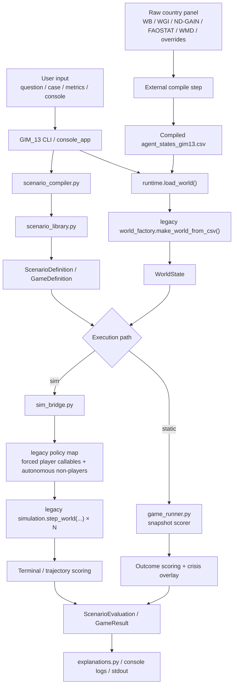
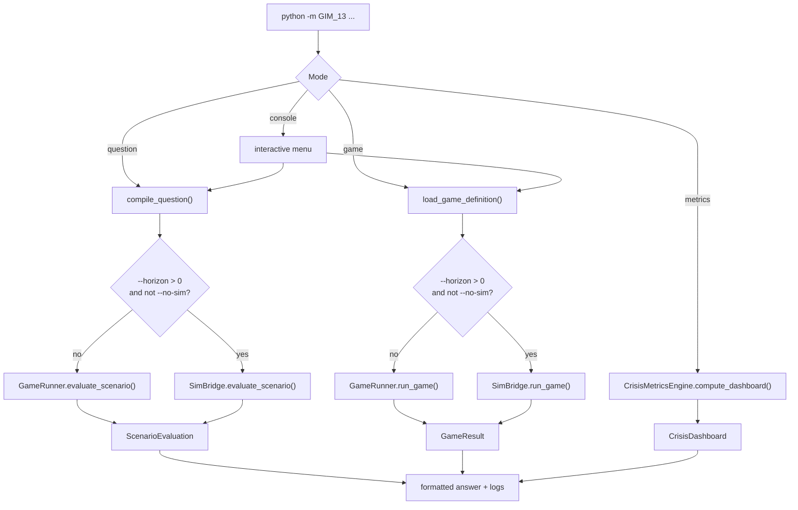
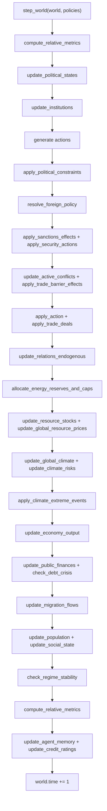

# GIM_13

This document consolidates the current logic of the model stack across `GIM_13`, the compiled `GIM_12` agent state, and the legacy yearly core `GIM_11_1`.

Scope:

- `GIM_13` is the orchestration, scenario, crisis-diagnostics, and policy-gaming layer.
- `GIM_12` provides the compiled world state and data pipeline.
- `GIM_11_1` remains the actual yearly state-transition engine.

Unless explicitly marked as conceptual, formulas and rules below reflect the current codebase as of March 12, 2026. If code and this document diverge, code is authoritative.

## 0. Repository Layout

The repository is intentionally split into two layers:

- core layer: scripts and runtime assets that are part of the active implementation;
- `misc/`: secondary materials, bundled fixtures, experimental state artifacts, helper assets, and archival documentation.

Current practical rule:

- keep executable model code in `GIM_13/`, `GIM_12/`, `legacy/`, and `tests/`;
- keep the production state in `GIM_12/agent_states.csv`;
- keep this `README.md` as the single canonical documentation file;
- keep secondary docs, demo cases, calibration fixtures, map assets, and opt-in experimental state under `misc/`.

That means the active runtime now reads secondary resources from:

- `misc/cases/`
- `misc/calibration_cases/`
- `misc/data/agent_states_gim13.csv`
- `misc/assets/credit_map/`
- `misc/docs/`

## 1. Model Task

The stack solves three related tasks:

1. Load a calibrated world state from `agent_states.csv`.
2. Interpret a question or case as a structured geopolitical scenario.
3. Evaluate that scenario along two parallel axes:
   - outcome probabilities across crisis and escalation classes;
   - crisis diagnostics for the selected actors and the global system.

Operationally, `GIM_13` does not replace the physical or macroeconomic simulation of the legacy core. It sits on top of the same world state and adds:

- scenario compilation;
- a fast static scorer over structured outcome classes;
- an optional simulation bridge into the yearly `step_world(...)` loop;
- crisis metric dashboards;
- policy-game search over action combinations;
- explainable console and CLI outputs.

`GIM_13` therefore exposes two execution paths that share the same output types:

- static path: `GameRunner` scores a single loaded `WorldState` snapshot and, when actions are present, applies a diagnostic crisis overlay;
- sim path: `SimBridge` translates the scenario into a mixed legacy `policy_map`, runs `step_world(...)` for `N` yearly steps, and then scores the terminal state and trajectory-derived crisis dashboard.

## 2. System View

### 2.1 High-Level Architecture



### 2.2 Main Modules

| Module | Role |
| --- | --- |
| `GIM_13/runtime.py` | Loads the calibrated `WorldState` and chooses which CSV to use. |
| `GIM_13/__main__.py` | CLI entrypoint with `question`, `game`, `metrics`, `console`. |
| `GIM_13/console_app.py` | Interactive launcher with basic inference logs. |
| `GIM_13/scenario_compiler.py` | Converts a question or JSON case into typed scenario objects. |
| `GIM_13/scenario_library.py` | Scenario templates, keyword routing, template biases, and shocks. |
| `GIM_13/game_runner.py` | Static snapshot scorer, tail-risk expansion, crisis overlay, payoffs, and fallback strategy ranking. |
| `GIM_13/sim_bridge.py` | Bridges `ScenarioDefinition` / `GameDefinition` into legacy `step_world(...)` runs and trajectory scoring. |
| `GIM_13/crisis_metrics.py` | Global and agent crisis metrics, archetype routing, and dashboard construction. |
| `GIM_13/explanations.py` | Human-readable formatting for CLI output. |
| `legacy/GIM_11_1/gim_11_1/simulation.py` | Actual yearly world step. |
| `legacy/GIM_11_1/gim_11_1/policy.py` | Autonomous country-policy selection (`llm`, `simple`, `growth`) used by the sim path. |
| `legacy/GIM_11_1/gim_11_1/world_factory.py` | CSV validation and construction of `WorldState`. |
| `misc/data/agent_states_gim13.csv` | Experimental compiled 57-actor state artifact consumed by `runtime.py` in opt-in mode. |

## 3. Top-Level Execution

### 3.1 Runtime and State Loading

`runtime.default_state_csv()` uses the following precedence:

1. `GIM13_STATE_CSV`, if explicitly set.
2. `misc/data/agent_states_gim13.csv`, but only if `GIM13_USE_EXPERIMENTAL_STATE=1`.
3. Otherwise `GIM_12/agent_states.csv`.

This means the new `57`-actor state is opt-in by design, so legacy tests and older cases are not silently broken.

### 3.2 CLI Modes



### 3.3 Question Mode

`question` mode is a single-scenario evaluator with two runtime branches.

1. Load `WorldState`.
2. Resolve actors from explicit arguments or infer them from the prompt.
3. Fix `base_year=2023`, because the compiled state currently represents a 2023 snapshot and the runtime is not yet date-selectable.
4. Detect a template.
5. Build `ScenarioDefinition`.
6. Choose execution path:
   - static path: if `--horizon=0` or `--no-sim`, score the loaded snapshot via `GameRunner.evaluate_scenario(...)`;
   - sim path: if `--horizon>0` and `--no-sim` is not set, instantiate `SimBridge`, build a legacy `policy_map`, run `step_world(...)` for `N` yearly steps, and score the terminal state.
7. Return the same `ScenarioEvaluation` type in both cases.

Current CLI semantics:

- `--horizon 0` is the default and keeps the historical static scorer behavior;
- `--sim` is an explicit opt-in alias for the sim path and requires `--horizon > 0`;
- on the current sim path, non-player countries default to legacy `llm` mode unless the bridge is called differently from code.

### 3.4 Policy Gaming Mode

`game` mode adds player objectives and action spaces and, like `question`, has both static and sim branches.

1. Load `WorldState`.
2. Read the case JSON.
3. Convert the embedded scenario to `ScenarioDefinition`.
4. Build `PlayerDefinition` objects with objectives and allowed actions.
5. Enumerate or truncate player action spaces exactly as in the static scorer.
6. For each combination, choose execution path:
   - static path: `GameRunner.run_game(...)` evaluates the selected action labels as score shifts on the loaded snapshot;
   - sim path: `SimBridge.run_game(...)` converts selected player actions into deterministic legacy `Action`-producing callables, leaves non-player countries on autonomous legacy policies, runs `step_world(...)` for each profile, and scores the terminal state plus trajectory-derived crisis deltas.
7. Score each player with the existing payoff logic.
8. Rank profiles by total payoff.
9. Return a `GameResult`. On the sim path this also carries `trajectory` for the best profile and `baseline_trajectory` for the no-action run.

If the full action space exceeds `256` combinations, each player action list is truncated to its first `3` actions and `truncated_action_space=True`.

### 3.5 Metrics Mode

`metrics` mode skips scenario scoring and produces only `CrisisDashboard`. If no agents are provided, it defaults to the top `5` economies in the loaded state.

### 3.6 Console Mode

`console` is a client path over the same primitives:

- choose `Policy Gaming` or `Q&A`;
- provide a bundled case or free-form question;
- choose `Simulation years [0 = static]`;
- optionally point to a state CSV;
- see basic logs while inference is running.

The console does not introduce a third model path. It exposes the same static-vs-sim branch through prompts instead of flags.

### 3.7 Reporting and Decision Artefacts

The reporting layer sits on top of `ScenarioEvaluation` / `GameResult` and does not introduce a third inference path.

Current reporting artifacts:

- formatted stdout via `explanations.py`;
- self-contained `dashboard.html` via `dashboard.py`;
- embedded `Decision Brief` section inside that dashboard;
- standalone Markdown export via `briefing.py`;
- optional `evaluation.json` sidecar for post-facto analysis or brief regeneration.

Reporting flow:

1. run `question`, `game`, or `console`;
2. obtain `ScenarioEvaluation` or `GameResult`;
3. optionally write `dashboard.html`;
4. optionally write `evaluation.json`;
5. optionally regenerate a standalone brief from the same JSON artifact.

The dashboard and Markdown brief are synchronized through a shared narrative layer in `decision_language.py`, which means they should use the same:

- run timestamp;
- run id;
- scenario summary;
- current reading;
- glossary terms;
- analyst highlights.

Current reporting contract:

- `dashboard.html` is the primary LPR-facing artifact;
- the dashboard includes the full `Decision Brief` rendered into HTML;
- the standalone `.md` brief is an export path, not a separate source of truth;
- if `--json` is passed together with `--dashboard`, `evaluation.json` is written next to the HTML file and can be fed back into `python -m GIM_13 brief --from-json ...`.

### 3.8 Sim Path Design Notes

`SimBridge` is the translation layer between `GIM_13` action vocabulary and the legacy yearly core.

Important implementation notes:

- forced player actions are implemented as deterministic callables, not plain dictionaries;
- this is deliberate, because legacy `step_world(...)` consumes a `policy_map` of `agent_id -> callable returning Action`;
- there is no native dict-based policy interface in `gim_11_1`, so callables are the minimal interoperable design;
- non-player countries remain on the legacy autonomous policy modes (`llm`, `simple`, `growth`);
- the static path remains available as the explicit fallback via `--no-sim` or `--horizon 0`.

Current cost model for the sim path is approximately:

```text
policy-game runtime ~ combinations × horizon_years × non-player policy invocations
```

This matters most in `game` mode because each strategy profile currently runs its own trajectory. In the current CLI implementation, sim-path `question` and `game` runs both default non-player countries to legacy `llm` mode, which is behaviorally faithful but can become expensive.

Dependency note:

- `GIM_13` currently vendors its own copy of `legacy/GIM_11_1`;
- `legacy/GIM_11_1/gim_11_1/simulation.py` in this repo carries a sync marker and should be refreshed from the canonical source before release;
- package unification is still outside the current scope.

## 4. Scenario Layer and Policy Gaming

### 4.1 Core Objects

| Object | Meaning |
| --- | --- |
| `ScenarioDefinition` | Structured scenario built from question, actors, year, template, shocks, and guardrails. |
| `GameDefinition` | Scenario plus players, objectives, constraints, and tags. |
| `PlayerDefinition` | Actor, allowed actions, and weighted objectives. |
| `ScenarioEvaluation` | Output of one scenario evaluation. |
| `GameResult` | Baseline evaluation, ranked combinations, best profile, and optional sim trajectories. |

### 4.2 Outcome Classes

Current outcome classes are:

- `status_quo`
- `controlled_suppression`
- `internal_destabilization`
- `limited_proxy_escalation`
- `maritime_chokepoint_crisis`
- `direct_strike_exchange`
- `broad_regional_escalation`
- `negotiated_deescalation`

Tail-risk classes are all of the above except `status_quo` and `negotiated_deescalation`.

The same action labels are used in both execution paths:

- on the static path they shift risk scores and crisis overlays through tables in `game_runner.py`;
- on the sim path each label must map explicitly to a legacy `Action` template in `sim_bridge.ACTION_TO_POLICY`;
- missing mappings raise `ValueError` during bridge construction rather than silently degrading behavior.

### 4.3 Actor Resolution and Question Compilation

`scenario_compiler.py` resolves actors in this order:

1. explicit actor names from CLI or case file;
2. alias dictionary such as `usa -> United States`, `turkiye -> Turkey`;
3. exact normalized country names and IDs;
4. substring matching against agent names;
5. fallback to the top `3` countries by GDP if nothing resolves.

`base_year` is set as:

- fixed to `2023` for all compiled scenarios, because the current state CSV is a 2023 snapshot and date-selectable source states have not yet been implemented.

Template selection is keyword-based unless explicitly overridden.

### 4.4 Scenario Templates

Current built-in templates are:

- `generic_tail_risk`
- `sanctions_spiral`
- `regional_pressure`
- `maritime_deterrence`
- `regime_stress`

Each template contains:

- a title and narrative;
- `risk_biases`;
- a list of monitored indicators;
- zero or more structured shocks.

### 4.5 Per-Actor Scenario Profile

For each selected actor, `GameRunner._profile_agent(...)` builds a compact feature vector from the world snapshot currently being scored:

- on the static path, this is the originally loaded world;
- on the sim path, this is the terminal `WorldState` after `N` yearly steps.

The profile itself is:

```text
debt_ratio = public_debt / max(gdp, 0.25)
resource_gap = mean(max(consumption - production, 0) / max(consumption, 1e-6))
energy_dependence = energy import gap ratio

debt_stress = max(debt_crisis_prone, max(debt_ratio - 0.3, 0))

social_stress =
    0.45 * social_tension
  + 0.25 * (1 - trust_gov)
  + 0.30 * (1 - regime_stability)

conflict_stress =
    0.30 * conflict_proneness
  + 0.25 * hawkishness
  + 0.20 * max(military_power - 0.75, 0)
  + 0.15 * (1 - security_index)
  + 0.10 * (1 - coalition_openness)

sanctions_pressure = 0.18 * active_sanctions_count + max(debt_ratio - 0.5, 0)
military_posture = 0.55 * military_power + 0.45 * security_index
climate_stress = 0.60 * climate_risk + 0.40 * water_stress
policy_space = political.policy_space

negotiation_capacity =
    0.40 * coalition_openness
  + 0.30 * trust_gov
  + 0.30 * regime_stability

tail_pressure =
    social_stress
  + conflict_stress
  + resource_gap
  + 0.40 * debt_stress
  + 0.20 * climate_stress
```

### 4.6 Aggregate Scenario Profile

Across all scenario actors, the runner takes the arithmetic mean of each feature and adds two system terms:

```text
multi_block_pressure = max((number_of_alliance_blocks - 1) / 3, 0)
actor_count_pressure = max((number_of_actors - 1) / 3, 0)
```

### 4.7 Base Outcome Scores

Before shocks and actions, raw outcome scores are:

```text
status_quo =
    0.65
  + 0.35 * (1 - social_stress)
  + 0.20 * (1 - conflict_stress)
  + 0.20 * policy_space
  - 0.15 * resource_gap

controlled_suppression =
    0.05
  + 0.75 * social_stress
  + 0.35 * military_posture
  - 0.20 * negotiation_capacity

internal_destabilization =
   -0.05
  + 0.95 * social_stress
  + 0.45 * debt_stress
  + 0.35 * resource_gap
  - 0.20 * policy_space

limited_proxy_escalation =
    0.00
  + 0.85 * conflict_stress
  + 0.25 * sanctions_pressure
  + 0.15 * actor_count_pressure

maritime_chokepoint_crisis =
   -0.15
  + 1.10 * energy_dependence
  + 0.40 * conflict_stress
  + 0.25 * resource_gap

direct_strike_exchange =
   -0.10
  + 0.90 * conflict_stress
  + 0.50 * military_posture
  + 0.20 * sanctions_pressure

broad_regional_escalation =
   -0.35
  + 0.30 * actor_count_pressure
  + 0.25 * multi_block_pressure
  + 0.35 * conflict_stress

negotiated_deescalation =
    0.10
  + 0.80 * negotiation_capacity
  + 0.15 * (1 - conflict_stress)
  - 0.20 * tail_pressure
```

Then:

```text
broad_regional_escalation += 0.30 * max(direct_strike_exchange, 0)
broad_regional_escalation += 0.20 * max(limited_proxy_escalation, 0)
```

Template-specific `risk_biases` are added directly to the corresponding scores.

### 4.8 Shocks, Actions, and Tail Expansion

Three additional transforms are applied to raw scores:

1. Scenario shocks.
   Current channels are `sanctions`, `proxy`, `maritime`, and `domestic`.
2. Action risk shifts.
   Each player action moves one or more outcome classes through `ACTION_RISK_SHIFTS`.
3. Tail expansion.

Tail expansion is:

```text
critical_pressure = max(tail_pressure - 1.25, 0)
additive_shift = (0.18 if critical_focus else 0) + 0.35 * critical_pressure

for each tail-risk class:
    score += additive_shift

status_quo -= 0.10 * critical_pressure
```

Escalatory and de-escalatory actions also have bundle effects:

```text
if escalation_count > 0:
    direct_strike_exchange += 0.06 * escalation_count
    broad_regional_escalation += 0.04 * escalation_count

if deescalation_count > 0:
    negotiated_deescalation += 0.08 * deescalation_count
    broad_regional_escalation -= 0.04 * deescalation_count
```

### 4.9 Probability Layer

Raw scores become probabilities via softmax:

```text
p_i = exp(score_i - max_score) / sum_j exp(score_j - max_score)
```

The model therefore preserves a full outcome distribution rather than forcing one deterministic forecast.

### 4.10 Consistency and Calibration

`evaluate_scenario(...)` computes two quality checks:

- `physical_consistency_score`
- `calibration_score`

Physical consistency is penalized when the outcome distribution is too extreme relative to the underlying drivers. Current penalties include:

- high `broad_regional_escalation` with low `conflict_stress`;
- high `maritime_chokepoint_crisis` with low route dependence and no maritime action;
- high `internal_destabilization` with weak domestic stress;
- high `direct_strike_exchange` with weak military posture and no military action.

Calibration is then adjusted for:

- unresolved actors;
- too much extreme outcome mass under weak tail pressure;
- overly large crisis shifts under weak tail pressure.

Final calibration score is blended with physical consistency:

```text
calibration_score = clamp01(0.50 * calibration_score + 0.50 * physical_consistency_score)
```

Criticality is a weighted sum of severe outcomes:

```text
criticality =
    0.50 * controlled_suppression
  + 0.80 * internal_destabilization
  + 0.60 * limited_proxy_escalation
  + 0.70 * maritime_chokepoint_crisis
  + 0.85 * direct_strike_exchange
  + 1.00 * broad_regional_escalation
```

### 4.11 Policy-Game Payoff

For each player:

```text
player_score =
    sum_over_objectives(
        objective_weight
      * (
            outcome_utility
          + action_bonus
          + agent_crisis_adjustment
          + global_crisis_adjustment
        )
    )
  - 0.25 * (1 - calibration_score)
  - 0.25 * (1 - physical_consistency_score)
```

Inputs to the score come from three registries:

- `OBJECTIVE_TO_RISK_UTILITY`
- `OBJECTIVE_TO_CRISIS_UTILITY`
- `OBJECTIVE_TO_GLOBAL_CRISIS_UTILITY`

Supported objective families are:

- `regime_retention`
- `reduce_war_risk`
- `regional_influence`
- `sanctions_resilience`
- `resource_access`
- `bargaining_power`

## 5. Crisis Metrics Layer

### 5.1 Role

`CrisisMetricsEngine` is a diagnostic layer. It does not mutate the underlying `WorldState`. It computes:

- `GlobalCrisisContext`
- per-actor `AgentCrisisReport`
- `CrisisDashboard`

### 5.2 Metric Shape

Each crisis metric contains:

- `value`
- `unit`
- `level`
- `momentum`
- `buffer`
- `trigger`
- `severity`
- `relevance`
- `threshold_flag`
- `contributors`

Severity is computed as:

```text
severity =
    clamp01(
        0.45 * level
      + 0.20 * max(momentum, 0)
      + 0.20 * (1 - buffer)
      + 0.15 * trigger
    )
```

### 5.3 Global Crisis Context

The four current global metrics are:

- `global_oil_market_stress`
- `global_energy_volume_gap`
- `global_sanctions_footprint`
- `global_trade_fragmentation`

Core aggregates:

```text
energy_gap_ratio = max(energy_demand - energy_supply, 0) / max(energy_supply, 1e-6)
sanctions_footprint = sanctions_links / (N * max(N - 1, 1))
avg_barrier = mean(trade_barrier over all relations)
avg_conflict = mean(conflict_level over all relations)

oil_benchmark =
    energy_price
  * (1 + 0.65 * energy_gap_ratio
       + 0.20 * sanctions_footprint
       + 0.15 * avg_conflict)
```

Levels are normalized into bounded `0..1` scales, then fed into the common severity formula.

If a prior `history` world is provided, `momentum` becomes:

```text
momentum = current_level - previous_level
```

### 5.4 Archetype Router

Each actor is first mapped to one archetype:

- `hydrocarbon_exporter`
- `fragile_conflict_state`
- `industrial_power`
- `advanced_service_democracy`
- `developing_importer`
- `mixed_emerging`

Decision order is important:

1. `hydrocarbon_exporter` if energy export ratio `>= 0.15` and region is `Middle East`.
2. `fragile_conflict_state` if `conflict_proneness >= 0.75` or `regime_stability <= 0.40`.
3. `industrial_power` if `gdp >= 10T` or `gdp >= 4T` with population `>= 150M`.
4. `advanced_service_democracy` if regime is democracy and GDP per capita `>= 35k`.
5. `developing_importer` if energy gap `>= 0.10` or reserves-to-GDP `< 0.15`.
6. Otherwise `mixed_emerging`.

The archetype selects a metric-specific `relevance` vector, so the same raw stress can matter differently across actors.

### 5.5 Agent Crisis Metrics

Common helpers:

```text
energy_gap = max(energy_consumption - energy_production, 0) / max(energy_consumption, 1e-6)
food_gap = max(food_consumption - food_production, 0) / max(food_consumption, 1e-6)
metals_gap = max(metals_consumption - metals_production, 0) / max(metals_consumption, 1e-6)

import_dependency = 0.50 * energy_gap + 0.30 * food_gap + 0.20 * metals_gap
```

Current metrics and their core formulas are:

#### Inflation

```text
inflation_estimate =
    base_inflation
  + 0.07 * max(energy_price - 1, 0) * (0.4 + 0.6 * energy_gap)
  + 0.05 * max(food_price - 1, 0) * (0.3 + 0.7 * food_gap)
  + 0.03 * max(metals_price - 1, 0) * (0.2 + 0.8 * metals_gap)
  + 0.04 * sanctions_scale
  + 0.03 * avg_trade_barrier
```

#### FX Stress

```text
import_bill_proxy = gdp * (0.08 + 0.24 * import_dependency + 0.10 * avg_trade_intensity)
monthly_import_bill = import_bill_proxy / 12
fx_cover_months = fx_reserves / monthly_import_bill
fx_level = max(6 - min(fx_cover_months, 6), 0) / 6
```

#### Sovereign Stress

```text
debt_gdp = public_debt / max(gdp, 1e-6)
interest_to_revenue = interest_payments / max(taxes, 1e-6)

sovereign_level =
    0.35 * normalize(debt_gdp, 0.6, 1.4)
  + 0.25 * normalize(interest_rate, 0.03, 0.15)
  + 0.20 * normalize(interest_to_revenue, 0.10, 0.40)
  + 0.20 * fx_level
```

#### Food Affordability Stress

```text
basket_price = 0.60 * food_price + 0.25 * energy_price + 0.15 * metals_price

food_level =
    0.45 * food_gap
  + 0.25 * normalize(basket_price, 1.0, 2.2)
  + 0.15 * inflation_level
  + 0.15 * (1 - income_buffer)
```

#### Protest Pressure

```text
protest_level =
    0.35 * base_protest_risk
  + 0.20 * inflation_level
  + 0.15 * unemployment_norm
  + 0.15 * food_level
  + 0.15 * (1 - trust_gov)
```

#### Regime Fragility

```text
regime_level =
    0.30 * (1 - regime_stability)
  + 0.20 * (1 - trust_gov)
  + 0.20 * social_tension
  + 0.15 * protest_level
  + 0.15 * sanctions_scale
```

#### Sanctions Strangulation

```text
sanctions_level =
    0.35 * sanctions_scale
  + 0.20 * avg_trade_barrier
  + 0.20 * global_trade_fragmentation.level
  + 0.15 * fx_level
  + 0.10 * clamp01(max(0.5 - avg_trade_intensity, 0) / 0.5)
```

#### Strategic Dependency

```text
reserve_stress =
    0.50 * normalize(max(5 - energy_reserve_years, 0), 0, 5)
  + 0.30 * normalize(max(3 - food_reserve_years, 0), 0, 3)
  + 0.20 * normalize(max(5 - metals_reserve_years, 0), 0, 5)

strategic_level = 0.60 * import_dependency + 0.40 * reserve_stress
```

#### Chokepoint Exposure

```text
chokepoint_level =
    0.40 * (energy_gap * avg_trade_intensity)
  + 0.20 * avg_trade_intensity
  + 0.25 * global_oil_market_stress.level
  + 0.15 * regional_route_risk
```

#### Oil Vulnerability

```text
oil_level =
    0.45 * energy_gap
  + 0.20 * (1 - min(energy_cover_days / 180, 1))
  + 0.20 * chokepoint_level
  + 0.15 * (energy_export_ratio * global_oil_market_stress.level)
```

#### Conflict Escalation Pressure

```text
conflict_level =
    0.30 * avg_conflict
  + 0.20 * (1 - avg_trust)
  + 0.15 * hawkishness
  + 0.15 * clamp01(military_power / 2)
  + 0.10 * sanctions_level
  + 0.10 * war_links
```

Top metrics for each actor are chosen by:

```text
rank = severity * relevance
```

### 5.6 Policy-Driven Crisis Overlay

Policy gaming does not recompute the world state. Instead it applies an overlay to the baseline crisis dashboard:

1. compute baseline dashboard for scenario actors;
2. deep-copy it;
3. apply `ACTION_CRISIS_SHIFTS` to:
   - `self` metrics of the acting player;
   - `others` metrics of the remaining scenario actors;
   - `global` metrics of the world context;
4. recompute metric severities;
5. compare adjusted vs baseline dashboards.

The per-metric shift logic is:

```text
metric.level += level_shift
metric.buffer -= 0.60 * level_shift
metric.trigger += 0.80 * level_shift
metric.momentum = level_shift
metric.severity = common_severity_formula(...)
```

The overlay returns:

- `crisis_delta_by_agent`
- `crisis_signal_summary`

Current aggregate signals are:

- `net_crisis_shift`
- `macro_stress_shift`
- `stability_stress_shift`
- `geopolitical_stress_shift`
- `global_context_shift`
- `worst_actor_shift`

## 6. Legacy Yearly Core

### 6.1 Role

`GIM_11_1` is still the real simulation engine. It mutates `WorldState` one year at a time. `GIM_13` reads that state and reasons over it, but does not replace the yearly macro-physical transition.

### 6.2 Yearly Step Order



### 6.3 Economy

Production uses a Cobb-Douglas form:

```text
GDP_potential = TFP * TechFactor * K^0.30 * L^0.60 * E^0.10
L = population / 1e9
E = (energy_consumption / 1000) * energy_efficiency
TechFactor = 1 + 0.6 * max(tech_level - 1, 0)
```

Observed GDP partially adjusts toward potential:

```text
gap = (GDP_target - GDP_now) / GDP_now
adjust_speed = 0.30 + 0.35 * clamp01(max(gap, 0))
GDP_next = (1 - adjust_speed) * GDP_now + adjust_speed * GDP_target
```

Where:

```text
GDP_target = GDP_potential * scale_factor * effective_damage_multiplier
```

Capital accumulation is endogenous:

```text
savings_rate = 0.24 * (0.7 + 0.6 * regime_stability - 0.4 * social_tension)
savings_rate = clamp(savings_rate, 0.05, 0.40)
K_next = (1 - 0.05) * K + savings_rate * GDP
```

TFP dynamics are implemented in `metrics.py`:

```text
rd_share = rd_spending / GDP
spillover = 1 + 0.3 * avg_trade_intensity
diffusion = 0.02 * avg_trade_weighted_tech_gap
tfp_growth = 0.01 + 2.0 * rd_share * spillover + diffusion
tfp_growth = clamp(tfp_growth, -0.05, 0.05)
TFP_next = TFP * (1 + tfp_growth)
```

### 6.4 Public Finance and Debt

Baseline fiscal structure:

```text
baseline_spending =
    GDP * (0.15 + 0.035 + (0.005 + 0.015 * climate_risk))

policy_spending =
    social_spending + military_spending + rd_spending

gov_spending = baseline_spending + policy_spending
taxes = 0.22 * GDP
```

Effective interest rate:

```text
debt_gdp = public_debt / GDP
excess = max(debt_gdp - 0.6, 0)
spread_raw = 0.03 * excess + 0.10 * excess^2

spread =
    spread_raw
  * (0.5 + 0.5 * debt_crisis_prone)
  * (0.7 + 0.6 * (1 - regime_stability))

rate = 0.02 + min(spread, 0.25) + contagion_spread
rate = clamp(rate, 0.0, 0.35)
```

Debt update:

```text
interest_payments = rate * public_debt
primary_deficit = gov_spending - taxes
total_deficit = primary_deficit + interest_payments

if total_deficit > 0:
    new_borrowing = min(total_deficit, 0.05 * GDP)
else:
    public_debt += total_deficit

public_debt += new_borrowing
```

Debt crisis trigger:

```text
if debt_gdp > 1.2 and interest_rate > 0.12:
    debt *= 0.6
    gdp *= 0.9
    unemployment += 0.05
    trust_gov -= 0.15
    social_tension += 0.15
    regime_stability -= 0.15
```

### 6.5 Resources

Energy allocation is constrained by global reserves and annual supply caps. If country-level reserve keys exist, both global reserves and annual supply caps are distributed proportionally to each actor's energy reserve share.

Resource stocks update as follows:

- energy production is capped by reserve availability and annual cap;
- food reserves regenerate;
- metals allow recycling and price-based substitution;
- global reserves are reduced by primary production and increased by regeneration or tech expansion.

Global prices move by imbalance:

```text
imbalance = (demand - supply) / (supply + epsilon)
price_next = clamp(price_now * (1 + 0.15 * imbalance), 0.3, 5.0)
```

### 6.6 Climate

The climate block has four pieces:

1. emissions update from GDP, technology, energy efficiency, fuel tax, and decarbonization trend;
2. a four-pool carbon cycle;
3. radiative forcing plus a two-layer energy-balance model;
4. climate risk and extreme-event damage.

Emissions:

```text
intensity =
    base_co2_intensity
  * exp(-0.12 * max(tech_level - 1, 0))
  * (1 / energy_efficiency)
  * exp(-0.049 * time)
  * tax_effect

emissions = GDP * intensity * (1 - policy_reduction) * 1.8
```

Current coded constants are:

```text
CARBON_POOL_FRACTIONS = (0.2173, 0.2240, 0.2824, 0.2763)
CARBON_POOL_TIMESCALES = (inf, 394.4, 36.54, 4.304)
DEFAULT_ECS = 3.0, bounded to [1.5, 4.0]
DEFAULT_F_NONCO2 = 0.0
DEFAULT_HEAT_CAP_SURFACE = 20.0
DEFAULT_HEAT_CAP_DEEP = 100.0
DEFAULT_OCEAN_EXCHANGE = 0.7
```

Carbon cycle:

```text
pool_i_next = pool_i * exp(-dt / tau_i) + fraction_i * total_emissions
CO2_next = CO2_preindustrial + sum(pool_i_next)
```

Forcing and temperature:

```text
F_CO2 = 5.35 * ln(C / C0)
F_total = F_CO2 + F_nonCO2
lambda = F2XCO2 / ECS

T_surface_next =
    T_surface
  + dt / C_surface * (F_total - lambda * T_surface - ocean_exchange * (T_surface - T_ocean))

T_ocean_next =
    T_ocean + ocean_exchange * (T_surface - T_ocean) * dt / C_deep
```

Climate risk update:

```text
base =
    0.30
  + 0.45 * water_stress
  + 0.15 * gini_share

temp_component = 1 - exp(-0.45 * delta_temperature)
target = clamp01(base + (1 - base) * temp_component)
climate_risk_next = climate_risk + 0.06 * (target - climate_risk)
```

Damage enters the economy through `effective_damage_multiplier(...)`, which is the term used in:

```text
GDP_target = GDP_potential * scale_factor * effective_damage_multiplier
```

The current coded damage link is:

```text
delta_t = temperature_global - TGLOBAL_2023_C

benefit =
    0.006 * exp(-((delta_t - 0.3)^2) / (2 * 0.5^2))

loss = 0.006 * temperature_global^2

climate_damage_multiplier =
    max(0, 1 + benefit - loss)

effective_damage_multiplier =
    climate_damage_multiplier
  * (1 + 0.005 * (1 - climate_risk))
```

This is the current implementation-specific damage mapping, not a DICE-style damage function.

Extreme events remain stochastic, but their likelihood and impact are damped by endogenous resilience built from:

- regime stability;
- technology;
- trust;
- adaptation spending.

The current event logic is:

```text
resilience =
    0.40 * regime_stability
  + 0.30 * clamp01(tech_level / 2)
  + 0.15 * trust_gov
  + 0.15 * clamp01(climate_adaptation_spending / (0.03 * GDP))

event_prob =
    (0.012 + 0.07 * climate_risk)
  * (1 + 0.15 * max(temperature_global - TGLOBAL_2023_C, 0))
  * (1 - 0.40 * resilience)

severity =
    (0.03 + 0.15 * climate_risk)
  * (1 - 0.50 * resilience)
```

### 6.7 Social and Political Dynamics

Population, migration, trust, tension, inequality, and regime collapse remain endogenous.

Population update:

```text
availability_ratio =
    (food_production + 0.2 * food_reserve) / max(food_consumption, 1e-6)

scarcity = max(1 - clamp(availability_ratio, 0, 2), 0)

prosperity =
    1 / (1 + exp(-1.2 * ln(max(gdp_pc / baseline_gdp_pc, 1e-6))))

birth_rate =
    clamp(
        (0.025 - 0.000001 * gdp_pc)
      * (1 - 0.5 * prosperity)
      * (1 - 0.6 * scarcity)
      * (1 - 0.3 * gini_share),
        0.006,
        0.04
    )

death_rate =
    clamp(
        (0.012 - 0.0000005 * gdp_pc)
      * (1 + 1.0 * scarcity + 0.4 * gini_share)
      * (1 - 0.2 * prosperity),
        0.004,
        0.03
    )

population_next = population * (1 + birth_rate - death_rate)
```

Migration update:

```text
origin_push =
    0.6 * income_gap_to_baseline
  + 0.4 * conflict_proneness

outflow =
    min(0.001 * population * origin_push, 0.003 * population)

destination_weight =
    trade_intensity
  * positive_income_gap
  * (1 - 0.5 * destination_conflict_proneness)
```

Trust and tension update:

```text
trust_change =
    0.00005 * (gdp_per_capita / 10000)
  - 0.025 * unemployment
  - 0.025 * inflation
  - 0.0004 * inequality_gini
  - 0.08 * max(social_tension - 0.3, 0)

trust_gov_next = clamp(trust_gov + trust_change, 0, 1)

inequality_sensitivity = 1 - idv / 100

tension_change =
    0.0005 * inequality_gini * inequality_sensitivity
  + 0.01 * unemployment
  + 0.005 * inflation
  + 0.06 * (0.5 - trust_gov_next)

social_tension_next = clamp(social_tension + tension_change, 0, 1)
```

Inequality update:

```text
gdp_growth = (gdp - prev_gdp) / max(prev_gdp, 1e-6)

gini_next =
    clamp(
        gini
      + 6.0 * gdp_growth
      + 4.0 * abs(min(gdp_growth, 0)) * (0.5 + social_tension)
      - 60.0 * social_spending_change
      + 1.2 * (social_tension - 0.4),
        20,
        70
    )
```

Regime collapse trigger:

```text
if trust_gov < 0.2 and social_tension > 0.8:
    capital *= 0.7
    gdp *= 0.8
    public_debt *= 0.7
    regime_stability -= 0.2
```

## 7. Data Contract and State Pipeline

### 7.1 Two-Layer Data Model

The stack uses two distinct data layers:

1. source layer: real-world or imputed country panel in raw units;
2. compiled model layer: normalized `agent_states.csv` consumed by the loader.

The compiled CSV is a model-facing artifact, not a raw statistical extract.

### 7.2 Loader Contract

The loader currently requires these columns:

- `id`
- `name`
- `region`
- `regime_type`
- `gdp`
- `population`
- `fx_reserves`
- `trust_gov`
- `social_tension`
- `inequality_gini`
- `climate_risk`
- `pdi`
- `idv`
- `mas`
- `uai`
- `lto`
- `ind`
- `traditional_secular`
- `survival_self_expression`

Optional numeric inputs accepted by the loader include:

- `capital`
- `public_debt`
- `public_debt_pct_gdp`
- `co2_annual_emissions`
- `biodiversity_local`
- `water_stress`
- `regime_stability`
- `debt_crisis_prone`
- `conflict_proneness`
- `tech_level`
- `military_power`
- `security_index`
- all resource stock and flow columns

Important loader rules:

- `capital` is optional; if missing, it becomes `3 * gdp`.
- `public_debt_pct_gdp` is accepted and converted into absolute `public_debt`.
- physical quantities must not be negative.
- bounded scores must remain in range.

### 7.3 Canonical Model CSV Semantics

The current working contract is:

- required fields are only those actually needed to construct a valid `AgentState`;
- resource fields are model-normalized stock and flow variables, not raw FAO or energy workbook units;
- deprecated fields such as `military_gdp_ratio` should stay out of the compiled CSV;
- residual aggregates must be built from raw country totals before normalization.

### 7.4 Units

| Group | Unit in compiled CSV |
| --- | --- |
| `gdp`, `public_debt`, `fx_reserves`, `capital` | current USD trillions |
| `population` | persons |
| `co2_annual_emissions` | GtCO2e |
| `inequality_gini`, Hofstede dimensions | `0..100` |
| `traditional_secular`, `survival_self_expression` | `0..10` |
| bounded risk and society scores | `0..1` |
| `tech_level`, `military_power` | positive model multipliers |
| resources | model-normalized units |

### 7.5 Source Groups

| Block | Preferred sources |
| --- | --- |
| Macro | World Bank, IMF, official Taiwan series |
| Governance and institutions | WGI, OECD or survey proxies |
| Climate and environment | World Bank, ND-GAIN, other official inventories |
| Culture and values | Hofstede, WVS |
| Resources | World Mining Data, World Bank energy balance, FAOSTAT, overrides |

### 7.6 Build Rules for the New State

The new state pipeline follows:

1. build a full country panel in real units;
2. select top-50 economies by 2023 nominal GDP;
3. keep Taiwan as an explicit actor even if it is outside the top-50 ranking;
4. aggregate all remaining countries into residual regions;
5. sum raw quantities first;
6. only then normalize into model units and compute latent scores.

Aggregation rules:

- additive: `gdp`, `population`, `fx_reserves`, `public_debt`, `co2_annual_emissions`, raw resource totals;
- weighted average: Gini, Hofstede, WVS, climate risk, water stress, biodiversity, trust, regime stability;
- recompute after aggregation: `social_tension`, `debt_crisis_prone`, `conflict_proneness`, `tech_level`, `security_index`, `military_power`, `food_reserve`.

### 7.7 Compile Walkthrough

Operationally, the state build process should be read as a six-stage compile boundary:

1. `Source ingest`
   Pull macro, governance, climate, cultural, and resource inputs into a country-level raw panel.
2. `Roster selection`
   Keep top-50 by 2023 nominal GDP and force Taiwan to remain explicit.
3. `Row-level backfill`
   Fill missing values using latest available observation, official overrides, or regional/statistical imputations.
4. `Residual aggregation`
   Aggregate all non-top actors into residual regional buckets using raw quantities, not normalized residual subtraction.
5. `Model transformation`
   Convert real-world quantities into model units and recompute latent scores such as `social_tension`, `security_index`, and `military_power`.
6. `Validation and export`
   Enforce schema, non-negativity, bound checks, and uniqueness, then export the compiled CSV consumed by `runtime.py`.

In this repository, the runtime consumes only the compiled artifacts:

- `GIM_12/agent_states.csv`
- `misc/data/agent_states_gim13.csv`

The raw source panel and upstream build tooling are conceptually outside the runtime path of this repo.

### 7.8 Validation Rules

The compiled CSV must satisfy:

- no duplicate `id`;
- no duplicate `name`;
- no negative physical quantities;
- all `0..1` scores inside bounds;
- Hofstede values in `0..100`;
- WVS axes in `0..10`;
- aggregate rows built from raw totals, not normalized residual subtraction.

The current pipeline was specifically redesigned to avoid artifacts such as negative metals in aggregate rows.

## 8. Limitations

Current limitations that matter operationally:

- The static path (`--horizon 0` or `--no-sim`) still scores a world snapshot plus a crisis overlay. Only the sim path reruns the yearly world engine.
- The sim path currently scores the terminal state plus trajectory-derived crisis diagnostics; it does not yet optimize on full path-integrated utility over every intermediate state.
- On the sim path, player countries are forced through deterministic action templates, while non-player countries stay on legacy autonomous policies. That is operationally useful, but it is not the same as giving every player country an unconstrained LLM deliberation step.
- The crisis overlay remains diagnostic and comparative, not a second physics engine. On the sim path, crisis deltas are recomputed from actual terminal and historical states instead of synthetic metric shifts.
- Outcome coefficients, template biases, action shifts, and crisis weights are hand-tuned model parameters, not structural econometric estimates.
- Sim-path `game` runs can become expensive because each action profile triggers its own `step_world(...)` trajectory and non-player countries currently default to legacy `llm` mode in the CLI path.
- If the action space grows beyond `256` combinations, the runner truncates each player action set to its first `3` actions for tractability.
- Cultural and values fields such as Hofstede and WVS axes are structural and often imputed rather than true annual measurements.
- `GIM_13` still vendors `legacy/GIM_11_1` instead of importing a shared package, so source-sync discipline remains necessary.
- The experimental `57`-actor state remains opt-in and should be treated as an actively curated baseline rather than a frozen production state.

## 9. Boundaries and Interpretation

The current model should be read with these boundaries in mind:

- `GIM_13` is a scenario and policy-gaming layer, not a second world physics engine.
- crisis metrics are proxy-based diagnostics, though implemented deterministically from current state variables.
- on the static path, the policy overlay changes the crisis dashboard, not the underlying yearly world state.
- on the sim path, selected player actions and autonomous non-player policies do flow into `step_world(...)` and therefore do change the underlying `WorldState`.
- structural cultural and values indicators are slow-moving and often imputed rather than truly annual.
- the compiled agent state is a curated model input, not a raw public-data dump.

## 10. Recommended Reading Order

If this document is used as the primary documentation set, the intended reading order is:

1. sections `1-3` for model purpose and execution;
2. section `4` for scenario logic and policy gaming;
3. section `5` for crisis diagnostics;
4. section `6` for the yearly simulation core;
5. section `7` for the state schema and data pipeline.

That order matches the operational stack from user-facing behavior back down to the underlying state-transition mechanics.
