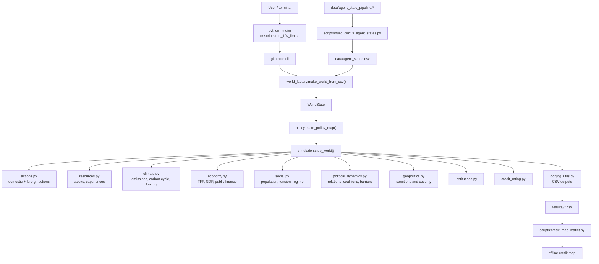
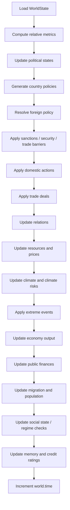

# GIM_14

`GIM_14` is the new local primary working repository for the simulator.

It unifies the active yearly simulation core from `GIM_11_1`, the compiled state and source-data pipeline from `GIM_12`, and the question/game/reporting layer that had been built in `GIM_13`. The goal of this repo is to become the clean working line for the next calibration and restructuring passes without deleting or rewriting the older version folders.

Current scope:

- this repository contains the active world simulation engine, compiled state, source-data pipeline, and map assets
- this repository now also contains the locally restored `GIM_13` scenario, policy-gaming, dashboard, briefing, equilibrium, and calibration-suite layer
- `python -m gim` remains the world-simulation entrypoint, while `python -m gim question|game|metrics|console|brief|calibrate` restores the higher-level orchestration surface
- calibration reference documents from the `GIM_13` line are carried forward here so the next empirical calibration work can continue directly on top of `GIM_14`

## 1. What The Model Can Do

`GIM_14` currently supports the following capabilities:

- load a compiled multi-country world state from [data/agent_states.csv](/Users/theclimateguy/Documents/jupyter_lab/GIM_14/data/agent_states.csv)
- load the larger `57`-actor operational state from [data/agent_states_operational.csv](/Users/theclimateguy/Documents/jupyter_lab/GIM_14/data/agent_states_operational.csv)
- validate the state CSV before simulation via [world_factory.py](/Users/theclimateguy/Documents/jupyter_lab/GIM_14/gim/core/world_factory.py)
- run yearly simulations with endogenous updates to economy, resources, climate, geopolitics, politics, society, institutions, and creditworthiness
- choose between `simple`, `growth`, `llm`, and `auto` policy modes through the CLI and env vars
- compile free-text questions into structured geopolitical scenarios
- run static or simulated policy games from packaged JSON cases or free-text descriptions
- generate crisis dashboards, Markdown briefs, equilibrium diagnostics, and JSON evaluation artifacts
- run the operational `GIM_13` calibration suite locally through `python -m gim calibrate`
- generate detailed CSV logs of world trajectories, agent actions, and institution activity
- render an offline Leaflet credit-risk map from simulation logs
- rebuild and audit the compiled state inputs using the bundled source-data pipeline in [data/agent_state_pipeline](/Users/theclimateguy/Documents/jupyter_lab/GIM_14/data/agent_state_pipeline)
- serve as the clean migration base for the next calibration round

## 2. Repository Layout

```text
GIM_14/
├── gim/
│   ├── __init__.py
│   ├── __main__.py
│   ├── paths.py
│   ├── core/
│   └── game_theory/
├── data/
├── docs/
├── misc/
├── scripts/
├── tests/
├── vendor/
├── pyproject.toml
└── README.md
```

Main areas:

- [gim/](/Users/theclimateguy/Documents/jupyter_lab/GIM_14/gim) is the installable Python package
- [gim/core/](/Users/theclimateguy/Documents/jupyter_lab/GIM_14/gim/core) is the active yearly simulation engine
- [gim/game_runner.py](/Users/theclimateguy/Documents/jupyter_lab/GIM_14/gim/game_runner.py), [gim/sim_bridge.py](/Users/theclimateguy/Documents/jupyter_lab/GIM_14/gim/sim_bridge.py), and [gim/dashboard.py](/Users/theclimateguy/Documents/jupyter_lab/GIM_14/gim/dashboard.py) are the restored orchestration, policy-gaming, and reporting layer
- [data/](/Users/theclimateguy/Documents/jupyter_lab/GIM_14/data) holds the compiled state, raw pipeline cache, generated panels, and map geometry
- [misc/](/Users/theclimateguy/Documents/jupyter_lab/GIM_14/misc) holds packaged cases, calibration cases, and credit-map assets inherited from `GIM_13`
- [scripts/](/Users/theclimateguy/Documents/jupyter_lab/GIM_14/scripts) holds helper scripts for state building, map rendering, and long runs
- [docs/](/Users/theclimateguy/Documents/jupyter_lab/GIM_14/docs) holds the active public documentation set: methodology, calibration, migration, and data-contract docs
- [tests/](/Users/theclimateguy/Documents/jupyter_lab/GIM_14/tests) now holds both smoke checks and restored scenario/game/reporting regression tests

## 3. System View

### 3.1 High-Level Architecture



This is the key architectural change in `GIM_14`: the simulation core and the active data stack now sit in one clean repo instead of being split across version-numbered folders with inverted dependencies.

### 3.2 Yearly Simulation Loop



## 4. Core Modules

| Module | Role |
| --- | --- |
| [gim/core/cli.py](/Users/theclimateguy/Documents/jupyter_lab/GIM_14/gim/core/cli.py) | Main CLI entrypoint and run orchestration. |
| [gim/core/world_factory.py](/Users/theclimateguy/Documents/jupyter_lab/GIM_14/gim/core/world_factory.py) | CSV validation and `WorldState` construction. |
| [gim/core/simulation.py](/Users/theclimateguy/Documents/jupyter_lab/GIM_14/gim/core/simulation.py) | The yearly world-step loop. |
| [gim/core/policy.py](/Users/theclimateguy/Documents/jupyter_lab/GIM_14/gim/core/policy.py) | Policy mode resolution, LLM integration, and baseline policy heuristics. |
| [gim/core/actions.py](/Users/theclimateguy/Documents/jupyter_lab/GIM_14/gim/core/actions.py) | Domestic actions, trade deals, and direct policy application. |
| [gim/core/economy.py](/Users/theclimateguy/Documents/jupyter_lab/GIM_14/gim/core/economy.py) | GDP, TFP, capital, debt, and public-finance dynamics. |
| [gim/core/climate.py](/Users/theclimateguy/Documents/jupyter_lab/GIM_14/gim/core/climate.py) | Emissions intensity, carbon cycle, forcing, temperature, and climate risks. |
| [gim/core/social.py](/Users/theclimateguy/Documents/jupyter_lab/GIM_14/gim/core/social.py) | Population, migration, trust, inequality, and regime dynamics. |
| [gim/core/geopolitics.py](/Users/theclimateguy/Documents/jupyter_lab/GIM_14/gim/core/geopolitics.py) | Sanctions, security actions, and conflict propagation. |
| [gim/core/political_dynamics.py](/Users/theclimateguy/Documents/jupyter_lab/GIM_14/gim/core/political_dynamics.py) | Endogenous relation updates, coalitions, and trade-barrier logic. |
| [gim/core/resources.py](/Users/theclimateguy/Documents/jupyter_lab/GIM_14/gim/core/resources.py) | Resource production, consumption, depletion, and global pricing. |
| [gim/core/institutions.py](/Users/theclimateguy/Documents/jupyter_lab/GIM_14/gim/core/institutions.py) | International institution updates and reports. |
| [gim/core/credit_rating.py](/Users/theclimateguy/Documents/jupyter_lab/GIM_14/gim/core/credit_rating.py) | Yearly sovereign-style credit scoring and zones. |
| [gim/core/logging_utils.py](/Users/theclimateguy/Documents/jupyter_lab/GIM_14/gim/core/logging_utils.py) | Trajectory, action, and institution CSV logging. |
| [scripts/build_gim13_agent_states.py](/Users/theclimateguy/Documents/jupyter_lab/GIM_14/scripts/build_gim13_agent_states.py) | Current compiled-state build pipeline script carried over from `GIM_12`. |
| [scripts/credit_map_leaflet.py](/Users/theclimateguy/Documents/jupyter_lab/GIM_14/scripts/credit_map_leaflet.py) | Offline credit-map generator. |

## 5. Runtime Behavior

### 5.1 Entrypoints

Main world-simulation entrypoint:

```bash
python3 -m gim
```

Scenario and game entrypoints:

```bash
python3 -m gim question "Will Red Sea tensions escalate?"
python3 -m gim game --case misc/cases/maritime_pressure_game.json --dashboard
python3 -m gim metrics --agents Iran "United States"
python3 -m gim calibrate --runs 1
```

Helper script for 10-year LLM-backed runs:

```bash
./scripts/run_10y_llm.sh
```

### 5.2 Policy Modes

The simulator supports four policy modes:

- `simple`: deterministic baseline rule-based policies
- `growth`: deterministic growth-seeking policies
- `llm`: direct LLM-backed country policies
- `auto`: use `llm` only if runtime prerequisites are present, otherwise fall back automatically

### 5.3 Main Environment Variables

| Variable | Purpose | Default |
| --- | --- | --- |
| `STATE_CSV` | Path to input state CSV | [data/agent_states.csv](/Users/theclimateguy/Documents/jupyter_lab/GIM_14/data/agent_states.csv) |
| `MAX_COUNTRIES` | Country limit loaded from CSV | `100` |
| `SIM_YEARS` | Simulation horizon in years | `5` in CLI, `10` in helper script |
| `POLICY_MODE` | `auto|simple|growth|llm` | `auto` |
| `DEEPSEEK_API_KEY` | Required for `llm` mode | unset |
| `LLM_MAX_CONCURRENCY` | Parallel LLM worker count | `12` |
| `LLM_BATCH_SIZE` | Batch size for async policy calls | `20` |
| `SAVE_CSV_LOGS` | Write simulation logs | `0` in smoke-style runs |
| `GENERATE_CREDIT_MAP` | Build offline HTML map from logs | `1` |
| `SIM_SEED` | Random seed | unset |
| `DISABLE_EXTREME_EVENTS` | Disable endogenous climate extreme events | unset |

## 6. Data Layer

The active data layer has two parts:

1. compiled runtime state
2. source-data pipeline

Compiled runtime state:

- [data/agent_states.csv](/Users/theclimateguy/Documents/jupyter_lab/GIM_14/data/agent_states.csv)
- [data/agent_states_operational.csv](/Users/theclimateguy/Documents/jupyter_lab/GIM_14/data/agent_states_operational.csv)

Source-data pipeline:

- [data/agent_state_pipeline/generated/actor_base_inputs.csv](/Users/theclimateguy/Documents/jupyter_lab/GIM_14/data/agent_state_pipeline/generated/actor_base_inputs.csv)
- [data/agent_state_pipeline/generated/country_panel_raw.csv](/Users/theclimateguy/Documents/jupyter_lab/GIM_14/data/agent_state_pipeline/generated/country_panel_raw.csv)
- [data/agent_state_pipeline/generated/country_panel_imputed.csv](/Users/theclimateguy/Documents/jupyter_lab/GIM_14/data/agent_state_pipeline/generated/country_panel_imputed.csv)
- [docs/agent_state_data_contract.md](/Users/theclimateguy/Documents/jupyter_lab/GIM_14/docs/agent_state_data_contract.md)

The naming of [scripts/build_gim13_agent_states.py](/Users/theclimateguy/Documents/jupyter_lab/GIM_14/scripts/build_gim13_agent_states.py) is historical and will likely be cleaned up in a later pass, but the actual pipeline artifacts now live inside `GIM_14`.

## 7. Outputs

When logging is enabled, the model writes:

- world trajectory CSVs
- action logs
- institution logs
- optional offline credit map HTML

Real run artifacts are written into `results/<run-id>/` under the repo root, including
world CSVs, action logs, institution logs, optional credit maps, orchestration JSON,
dashboards, briefs, and run manifests.

## 8. Calibration Documents

Calibration continuity from the `GIM_13` line is preserved here through:

- [docs/CALIBRATION_REFERENCE.md](/Users/theclimateguy/Documents/jupyter_lab/GIM_14/docs/CALIBRATION_REFERENCE.md)
- [docs/CALIBRATION_LAYER.md](/Users/theclimateguy/Documents/jupyter_lab/GIM_14/docs/CALIBRATION_LAYER.md)

These files now describe the active calibration stack that runs directly inside `GIM_14`, including the restored historical backtest, decarb sensitivity, manifest binding, geo-calibration, and operational scenario suite.

The crisis suite now also includes stable negative-control cases and an explicit outcome-weight sensitivity sweep, so `python3 -m gim calibrate` is no longer evaluating only high-stress historical episodes.

The latest completed climate/macro pass inside `GIM_14` delivered these working baselines on the bundled `2015-2023` replay:

- GDP RMSE `1.074 T$`
- global CO2 RMSE `1.632 GtCO2`
- temperature RMSE `0.136 C`
- temperature bias `-0.005 C` with predicted interannual std `0.093 C` versus observed `0.103 C`

It also left three explicit calibration conclusions in place:

- `DECARB_RATE_STRUCTURAL` is active at `0.052`, while the manifest records the lower observed reference separately
- `GAMMA_ENERGY` is now `0.07`, identified from a bounded cross-sectional `2015` regression rather than from the time-series backtest
- `TFP_RD_SHARE_SENS` is now `0.5` as the current backtest-calibrated working value

The latest temperature pass added one more explicit conclusion:

- temperature realism is now handled as an ensemble problem, not a single deterministic path; `HEAT_CAP_SURFACE = 30.0`, the backtest deep-ocean anchor uses `T_surface - 0.60`, and annual natural variability is modeled with `TEMP_NATURAL_VARIABILITY_SIGMA = 0.08`

The latest crisis calibration pass added two more working conclusions:

- `operational_v1` now has `11` packaged cases, including `4` stable `status_quo` controls
- the new `misc/calibration/sensitivity_sweep.py` probe found no pass/fail flips under `+-20%` perturbations of the outcome layer on the current suite, which is a good robustness signal but also a reminder that richer historical crisis cases are still needed for sharper identification

## 8.1 Core Documentation Set

The active documentation set for `GIM_14` is:

- [docs/MODEL_METHODOLOGY.md](/Users/theclimateguy/Documents/jupyter_lab/GIM_14/docs/MODEL_METHODOLOGY.md)
- [docs/CALIBRATION_REFERENCE.md](/Users/theclimateguy/Documents/jupyter_lab/GIM_14/docs/CALIBRATION_REFERENCE.md)
- [docs/CALIBRATION_LAYER.md](/Users/theclimateguy/Documents/jupyter_lab/GIM_14/docs/CALIBRATION_LAYER.md)
- [docs/MIGRATION_NOTES.md](/Users/theclimateguy/Documents/jupyter_lab/GIM_14/docs/MIGRATION_NOTES.md)
- [docs/agent_state_data_contract.md](/Users/theclimateguy/Documents/jupyter_lab/GIM_14/docs/agent_state_data_contract.md)

## 9. Testing

The current `GIM_14` regression surface includes:

- smoke tests for the unified world-core CLI
- restored `GIM_13` parity tests for `question`, `game`, `sim_bridge`, `dashboard`, `briefing`, `crisis_metrics`, `geo_calibration`, `equilibrium`, `case_builder`, and `compiled_policy`
- restored calibration tests for manifest binding, climate forcing, country macro priors, historical backtest, decarb sensitivity, and operational calibration
- optional-path skips for `requests` and `scipy`

Run them with:

```bash
cd /Users/theclimateguy/Documents/jupyter_lab/GIM_14
python3 -m unittest discover -s tests -v
```

At the moment the full local suite verifies:

- default state availability
- successful world loading
- successful one-step simulation
- successful world CLI execution
- question compilation and actor resolution on the large `GIM13` state
- policy-game scoring and action overlays
- simulated trajectories through `SimBridge`
- HTML dashboard generation and Markdown brief generation
- crisis metrics, geo-calibration, and equilibrium search plumbing
- manifest-bound climate artifact loading
- historical backtest and decarb sensitivity validation
- operational calibration suite regression checks

The latest local full run completed with `85 tests`, `OK`, `3 skipped`.

## 10. Migration Status

`GIM_14` is now the clean working base for the next phase and locally restores the main `GIM_13` operational surface.

Already done:

- active core moved into a single installable package
- active data/pipeline assets copied into the new repo
- operational cases, calibration cases, and dashboard assets restored under `misc/`
- `question`, `game`, `metrics`, `console`, `brief`, and `calibrate` commands restored into `gim`
- dashboard, briefing, equilibrium, geo-calibration, and compiled-policy modules restored
- `historical_backtest`, `decarb_sensitivity`, `state_artifact`, `calibration_params`, and `country_params` restored into the active calibration layer
- manifest and historical-fixture refresh scripts restored under `misc/calibration`
- hybrid CLI added so `python -m gim` still runs the world simulator while subcommands run the higher-level orchestration layer
- restored parity tests added and passing locally
- public docs reduced to the active `GIM_14` set instead of legacy snapshots

Still expected later:

- clean historical names such as `build_gim13_agent_states.py`
- keep expanding tests from restored compatibility into native `GIM_14` regression contracts
