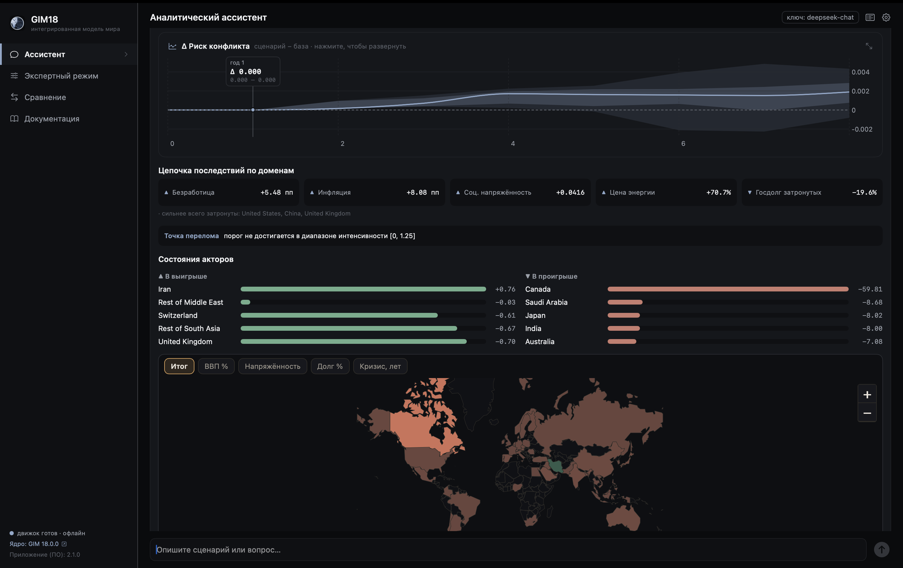
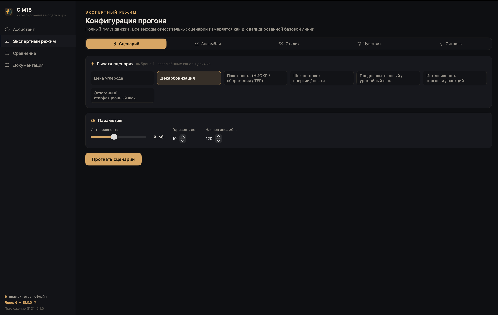

# Global Integrated Model — GIM18 (v18.1.3)

A year-by-year simulation of the world as interacting countries (~50 countries plus regional
groupings), integrating **economy, climate, climate damage, resources, society, politics,
geopolitics, culture, risk/crises and finance** into one model. It is built for scenario
exploration and uncertainty-aware analysis — "what tends to happen, and how confident can we be" —
not pinpoint forecasting.

**New here? Start with [`docs/MODEL_LAYERS.md`](docs/MODEL_LAYERS.md)** — a plain-language tour of
every layer, what it can do, and its limits. For where the model stands and what comes next, see
[`docs/ROADMAP.md`](docs/ROADMAP.md).

## Status (v18.1.3)

- All runs start from a single **validated 2023 canon** compiled state
  (`data/agent_states_operational.csv`): 57 actors covering essentially all of world output
  (GDP ≈ $107T, population ≈ 8.06B, CO₂ ≈ 38 Gt), reconciled against World Bank / UN / Global
  Carbon Project to within ~1%. See [`docs/agent_state_data_contract.md`](docs/agent_state_data_contract.md).
- Economy reproduces 2015–2023 national-income history; climate matches the mainstream scientific
  assessment (temperature sensitivity and the 1990–2023 warming/carbon record).
- Headline regression ("golden") backtest: GDP error ≈ 0.60, global CO₂ error ≈ 0.94, temperature
  error ≈ 0.145. The v18 reviewer-response cycle re-anchored the damage function to the Howard-Sterner
  central estimate and normalised it to the 2023 baseline (removing a base-year double-count, which
  *improved* the GDP fit from 0.62 to 0.60), and re-derived the internal-variability spread from the
  observed record (curing ensemble under-dispersion). The 1990–2023 climate calibration (ECS ≈ 3.0,
  temperature error ≈ 0.096) is unchanged.
- The headline economic core is **objective and fully closed**: a calibrated capital–energy
  substitution (nested-CES) production function, cost-minimising energy demand, energy/resource and
  capital markets that clear by price, a closed stock-flow-consistent bank balance sheet
  (money = deposits = loans), and SSP2-anchored forward growth. Long-run growth and emissions are
  **development-structured**: TFP conditional convergence (poorer economies catch up) and
  development-dependent decarbonisation (richer economies cut CO₂/GDP faster), both fit to the
  2015–2023 World Bank panel.
- Cost of carbon is horizon- and discounting-sensitive and reported honestly: ~$22 / $42 / $45 per
  tCO₂ at the 30 / 100 / 200-year horizons under DICE-2016 Ramsey discounting (ρ = 1.5%), rising to
  ~$89/tCO₂ (200-yr) under modern near-zero-ρ Ramsey discounting (ρ = 0.1%). Conflict-risk validated
  against the standard armed-conflict record (AUC ≈ 0.74, Brier skill ≈ +0.14 vs the base rate).
- Geographic coupling grounds shock propagation in a real spatial graph: literature-anchored trade
  gravity plus switchable conflict/tension/climate spatial contagion, checked by an
  emergent-spatial-autocorrelation reproduction benchmark (the payoff is concentrated in trade).
- Strict, accounting-consistent government finance (including through debt crises).
- A dedicated **weak-signal detection** module (Mahalanobis joint-state anomaly + structural-break
  change-point + critical-slowing-down) for what-if / early-warning analysis (`gim/weak_signal.py`).
- Deep-uncertainty mechanisms (carbon-cycle feedbacks, fat-tailed crisis severity, growth-effect
  damages) remain **switches, off by default**, so the headline run stays anchored and they are
  explored separately as uncertainty.

## Install

```bash
pip install -e .          # Python 3.10+
```

## Quick start

```bash
python3 -m gim                                   # core multi-year world simulation
python3 -m gim question "Will Red Sea tensions escalate?"
python3 -m gim game --case scenarios/maritime_pressure_game.json --dashboard
python3 -m gim metrics --agents Iran "United States"
python3 -m gim calibrate --suite operational_v1
```

Subcommands: `world`, `question`, `game`, `hybrid`, `metrics`, `calibrate`, `brief`, `console`.
Full command reference: [`COMMAND_REFERENCE.md`](COMMAND_REFERENCE.md). Run artifacts are written to
timestamped folders under `results/` (each with a `run_manifest.json`).

## Native app — GIM2 (`gim2/`)

The graphical shell is a **native macOS app** (SwiftUI, macOS 13+), not a browser page: a small,
deterministic Python engine (`python3 -m gim2 engine`, HTTP+SSE over loopback, schema `gim-engine/2`)
sits behind a Situation-Room-style interface with six areas —

<table>
<tr>
<td width="50%">

**Ассистент** — describe a scenario in words; the map shows per-country winners/losers.



</td>
<td width="50%">

**Экспертный режим** — direct control over every lever, horizon, and ensemble size.



</td>
</tr>
</table>

- **Ассистент** — natural-language front end. Describe a scenario in words; the assistant maps it to
  grounded levers or a composed scenario, runs the deterministic engine, and returns a verdict,
  tipping point, per-domain cascade, and per-country outcomes. All numbers come from the engine, never
  the language model. Every conversation is a named, on-disk session (survives a restart) with a raw
  agent-trace view for debugging why a given tool was routed.
- **Экспертный режим** — direct control: Сценарий (levers vs. baseline), Ансамбли (Monte-Carlo fans),
  Отклик (dose-response), Чувствительность (Morris screening, all 33 calibrated priors), Сигналы
  (Mahalanobis anomaly / structural-break / critical-slowing-down scan), and **Ролевая игра акторов**
  (below). Every chart shows the equivalent `python3 -m gim2 …` CLI command for reproducibility.
- **Сравнение** — every run made anywhere in the app (Экспертный режим or Ассистент) is written to disk
  individually and stays available across restarts; pick up to three against the validated baseline for
  a Δ matrix, with a PDF export per run or for the comparison as a whole.
- **Документация** / **Инструкции** — architecture, modules, data sources and the LLM tool-calling path
  on one tab; a practical analyst's guide (when to use which mode, how to read every chart, what's
  validated vs. exploratory) on the other.
- **Валидация** — retro-backtest RMSE, ensemble fans, conflict AUC, and Morris sensitivity, drawn live
  from the running engine (not static images).

**Ролевая игра акторов ("play as a country").** The one deliberate exception to "the engine is
deterministic, the LLM only narrates": pick up to five actors and an LLM compiles each one's multi-year
governing **doctrine** — a 9-dimensional vector (escalation bias, trade openness, sanctions tolerance,
mediation openness, …) derived from that country's own state — instead of the engine's scripted policy;
every other actor keeps running the scripted policy, so the run costs one LLM call per selected actor,
not per year or per country. A persona (protectionist hawk, dove, technocrat) can additively bias the
compiled doctrine. It reuses whichever LLM connection is already configured for the Assistant (a local
Ollama model or an OpenAI-compatible key); without one, doctrines fall back to a deterministic
heuristic. The point of the exercise is the per-year, per-actor decision log (what it did and, in its
own words, why) — a single trajectory, not an uncertainty ensemble, and explicitly **not** validated the
way the deterministic core is.

### Build & run

```bash
gim2/app/freeze/freeze_engine.sh   # PyInstaller-freeze the engine (~3 min, one-time; needs pyinstaller)
gim2/app/build_app.sh              # swift build -c release + assemble GIM18.app
gim2/app/make_dmg.sh               # (optional) wrap it in a drag-to-Applications GIM18-<ver>.dmg
open gim2/app/GIM18.app
```

`build_app.sh` embeds the frozen engine for a self-contained, offline app if
`gim2/app/Resources/gim-engine` exists (from the freeze step above); otherwise the app falls back to
launching `python3 -m gim2 engine` from the repo (dev mode). Engine bridge contract and CLI reference:
[`gim2/docs/ENGINE_BRIDGE_CONTRACT_v2.md`](gim2/docs/ENGINE_BRIDGE_CONTRACT_v2.md),
[`gim2/README.md`](gim2/README.md).

## Documentation

Full index: [`docs/README.md`](docs/README.md). Key entry points:

- Plain-language overview — [`docs/MODEL_LAYERS.md`](docs/MODEL_LAYERS.md)
- Where it stands / next steps — [`docs/ROADMAP.md`](docs/ROADMAP.md)
- Model specification & methodology — [`docs/GIM18_UNIFIED_MODEL_SPEC.md`](docs/GIM18_UNIFIED_MODEL_SPEC.md), [`docs/MODEL_METHODOLOGY.md`](docs/MODEL_METHODOLOGY.md)
- Calibration ledger — [`docs/CALIBRATION_REFERENCE.md`](docs/calibration/CALIBRATION_REFERENCE.md)

## Tests

```bash
python3 -m unittest discover -s tests             # full suite
./scripts/run_validation_package_gim18.sh         # release validation (non-LLM)
```

## Version

**`18.1.3` — trust_gov equilibrium anchor + per-agent tension reference (opt-in).** `trust_gov` had
no equilibrium term despite a code comment claiming otherwise: the `gini` sensitivity alone (~40×
the GDP-per-capita drift) dominates the per-year update, so trust decays at a near-constant rate
regardless of policy and, once past the tension threshold, a self-reinforcing trust↔tension coupling
takes over — a repeating collapse/partial-recovery cycle rather than a stable floor (confirmed:
scripted pro-/anti-stability policies produced statistically indistinguishable trajectories).
Fixed with a weak linear mean-reversion toward each agent's own base-year value
(`TRUST_ANCHOR_PULL`, default `0.0`, same pattern as the v18.1.2 resource-price anchor) and a
per-agent (not global-constant) tension reference. Verified but partial: at `TRUST_ANCHOR_PULL =
0.15` the collapse cycle is gone and the settling floor is measurably higher, but policy-sensitivity
is not yet restored — left **opt-in** pending that follow-on work. Golden backtest and full suite
(527 tests) are bit-identical at the default. See `CHANGELOG.md`.

### Lineage (v18.1.2)

**`18.1.2` — resource-price degeneracy fix (equilibrium anchor + demand growth).** The
reserve-buffer (v18.1.1) slowed a price move but not its destination: a persistent one-directional
imbalance still walked a price to its `[0.3, 5.0]` clamp and pinned there (energy → ceiling on
reserve depletion; food/metals → floor on structural over-supply), identically across seeds. Fixed on
the forward path with a weak price-equilibrium anchor (`PRICE_ANCHOR_PULL`), resource demand that
grows with population/income, a metals recycling fix (recycled supply no longer compounds into the
primary base), and an opt-in `forward_init` that balances the base-year markets. Prices now move and
respond to policy without pinning. Every change is a no-op at the base year, so the golden backtest is
**bit-identical** and the full suite is 527/527. See `CHANGELOG.md`.

### Lineage (v18.1.1)

**`18.1.1` — reserve-buffered resource-price clearing (forward-stability fix).** The instant
market-clearing rule treated every resource as a pure flow good, driving food/metals prices into
their clamp bounds within a few years on a plain forward run (metals carry a large above-ground
stock and a 4.7× baseline flow imbalance in the canon). Clearing now damps the demand/supply ratio
by the standing reserve already tracked in `global_reserves`, so prices stay smooth for 10–15 years;
thin-buffer food correctly remains the most volatile. Golden backtest **bit-identical**
(GDP 0.599 / CO₂ 0.939 / T 0.145); full suite 527/527. See `CHANGELOG.md`.

### Lineage (v18.1.0)

**`18.1.0` — SIPRI milex grounding (4-component CINC, F3+).** `economy.military_spending` is
populated at world build from a committed SIPRI 2023 grounding file (57 actors, 99.9% of the world
total), activating the military-expenditure component of the CINC capability index. Motivation (from
`docs/MILEX_GROUNDING_ANALYSIS.md`): the pop/energy/GDP proxy fits milex *levels* (r≈0.76) but is
anti-correlated with post-2022 militarization *dynamics* (share-change corr −0.115). Capability
ranking shifts to **USA > China** (documented departure from the steel-era COW mix; the proxy
configuration keeps the published-CINC anchor under flag-off). Golden backtest bit-identical
(**GDP 0.599 / CO₂ 0.939 / T 0.145**); conflict backtest **AUC 0.739 / BSS +0.123**.

### Lineage (v18.0.0)

**`18.0.0` — reviewer-response deepening + global sensitivity.** Closes reviewer issues #11–#19,
deepening the climate, economy and social modules and adding a Sobol global sensitivity analysis, with
golden discipline preserved (every change is bit-identical by default or a documented, backtest-in-band
re-anchor). Headline changes: forward non-CO₂ forcing follows the SSP2-4.5 marker (plateau, not an
unbounded linear trend), which lowers projected **2100 warming by ≈ 0.37 °C** and removes a forward
over-forcing bias; the **damage function** is re-anchored to the Howard-Sterner central estimate and
normalised to the 2023 baseline (no double-count — which *improved* the backtest); internal-variability
σ/ρ, β-convergence, and sovereign-spread coefficients are re-derived from data with reported
uncertainty. A Sobol analysis shows output variance is **concentrated and attributable** (climate
sensitivity → temperature, catch-up convergence → GDP, sovereign spreads → inequality) and that ten
priors are freezable. Golden backtest re-derived: **GDP 0.60 / CO₂ 0.94 / T 0.145** (climate ECS ≈ 3.0
unchanged). Full write-up: [`docs/GIM18_REVIEWER_RESPONSE.md`](docs/GIM18_REVIEWER_RESPONSE.md).

### Lineage (v17 family — historical)

- **`17.3.0`** — development-structured recalibration: fixed the no-policy forward baseline (carbon-pool
  seeding + a 2015 capital-init error the legacy decarb rate was silently cancelling) and grounded TFP
  conditional convergence and development-dependent decarbonisation in the 2015–2023 World Bank panel.
- **`17.2.x`** — cross-domain story: geographic coupling activated in the headline with a reproduction
  benchmark; social/political layers (S1–S6) on a reproducible numeric footing; economic core deepened
  (money→prices, growth foundations, near-rational expectations); integration made computational
  (carbon/DICE, oil/MESSAGEix, crop/AgMIP).
- **`17.1.x`** — statistical-rigor layer (conflict-AUC inference, Morris robustness, ensemble convergence).
- **`17.0.0`** — objective, fully-closed economic core (nested-CES production + market clearing + closed
  SFC bank balance sheet + SSP2 forward growth), enforceable invariants, deterministic runs, the full
  uncertainty machinery, and the weak-signal detection module.

Full history in [`CHANGELOG.md`](CHANGELOG.md).
