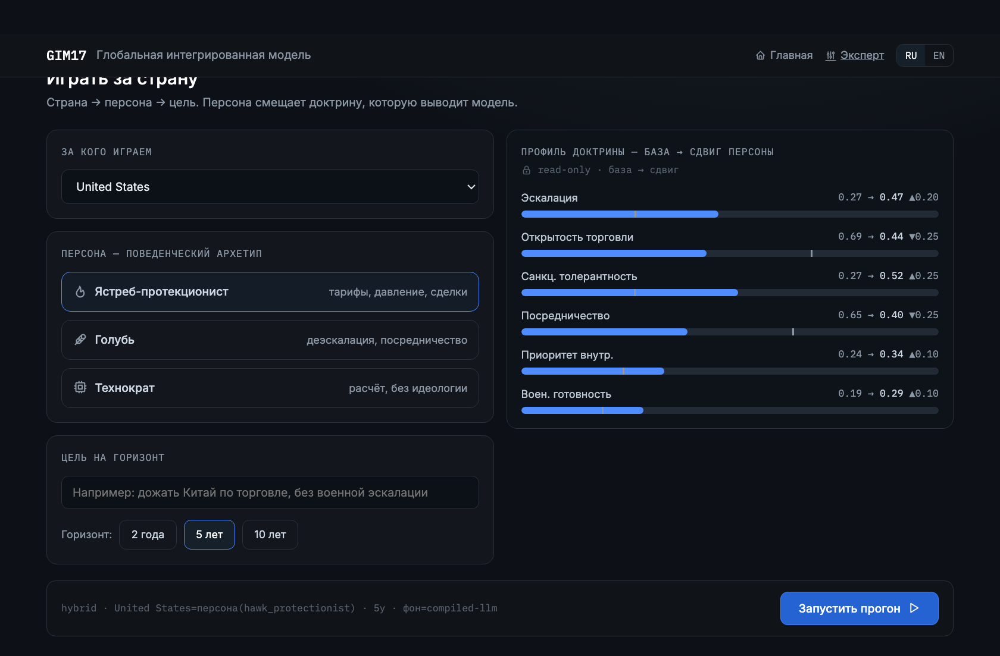

# Global Integrated Model — GIM18 (v18.0.0)

A year-by-year simulation of the world as interacting countries (~50 countries plus regional
groupings), integrating **economy, climate, climate damage, resources, society, politics,
geopolitics, culture, risk/crises and finance** into one model. It is built for scenario
exploration and uncertainty-aware analysis — "what tends to happen, and how confident can we be" —
not pinpoint forecasting.

**New here? Start with [`docs/MODEL_LAYERS.md`](docs/MODEL_LAYERS.md)** — a plain-language tour of
every layer, what it can do, and its limits. For where the model stands and what comes next, see
[`docs/ROADMAP.md`](docs/ROADMAP.md).

## Status (v18.0.0)

- All runs start from a single **validated 2023 canon** compiled state
  (`data/agent_states_operational.csv`): 57 actors covering essentially all of world output
  (GDP ≈ $107T, population ≈ 8.06B, CO₂ ≈ 38 Gt), reconciled against World Bank / UN / Global
  Carbon Project to within ~1%. See [`docs/agent_state_data_contract.md`](docs/agent_state_data_contract.md).
- Economy reproduces 2015–2023 national-income history; climate matches the mainstream scientific
  assessment (temperature sensitivity and the 1990–2023 warming/carbon record).
- Headline regression ("golden") backtest: GDP error ≈ 0.60, global CO₂ error ≈ 0.94, temperature
  error ≈ 0.145. The v18 reviewer-response cycle re-anchored the damage function to the Howard-Sterner
  central estimate and normalised it to the 2023 baseline (removing a base-year double-count, which
  *improved* the GDP fit from 0.62 to 0.60), and re-derived the internal-variability spread from the
  observed record (curing ensemble under-dispersion). The 1990–2023 climate calibration (ECS ≈ 3.0,
  temperature error ≈ 0.096) is unchanged.
- The headline economic core is **objective and fully closed**: a calibrated capital–energy
  substitution (nested-CES) production function, cost-minimising energy demand, energy/resource and
  capital markets that clear by price, a closed stock-flow-consistent bank balance sheet
  (money = deposits = loans), and SSP2-anchored forward growth. Long-run growth and emissions are
  **development-structured**: TFP conditional convergence (poorer economies catch up) and
  development-dependent decarbonisation (richer economies cut CO₂/GDP faster), both fit to the
  2015–2023 World Bank panel.
- Cost of carbon is horizon- and discounting-sensitive and reported honestly: ~$22 / $42 / $45 per
  tCO₂ at the 30 / 100 / 200-year horizons under DICE-2016 Ramsey discounting (ρ = 1.5%), rising to
  ~$89/tCO₂ (200-yr) under modern near-zero-ρ Ramsey discounting (ρ = 0.1%). Conflict-risk validated
  against the standard armed-conflict record (AUC ≈ 0.74, Brier skill ≈ +0.14 vs the base rate).
- Geographic coupling grounds shock propagation in a real spatial graph: literature-anchored trade
  gravity plus switchable conflict/tension/climate spatial contagion, checked by an
  emergent-spatial-autocorrelation reproduction benchmark (the payoff is concentrated in trade).
- Strict, accounting-consistent government finance (including through debt crises).
- A dedicated **weak-signal detection** module (Mahalanobis joint-state anomaly + structural-break
  change-point + critical-slowing-down) for what-if / early-warning analysis (`gim/weak_signal.py`).
- Deep-uncertainty mechanisms (carbon-cycle feedbacks, fat-tailed crisis severity, growth-effect
  damages) remain **switches, off by default**, so the headline run stays anchored and they are
  explored separately as uncertainty.

## Install

```bash
pip install -e .          # Python 3.10+
```

## Quick start

```bash
python3 -m gim                                   # core multi-year world simulation
python3 -m gim question "Will Red Sea tensions escalate?"
python3 -m gim game --case scenarios/maritime_pressure_game.json --dashboard
python3 -m gim metrics --agents Iran "United States"
python3 -m gim calibrate --suite operational_v1
python3 -m gim ui --host 127.0.0.1 --port 8090   # local analytical dashboard
```

Subcommands: `world`, `question`, `game`, `hybrid`, `metrics`, `calibrate`, `brief`, `console`, `ui`.
Full command reference: [`COMMAND_REFERENCE.md`](COMMAND_REFERENCE.md). Run artifacts are written to
timestamped folders under `results/` (each with a `run_manifest.json`).

## Decision-maker interface & LLM agents

`python3 -m gim ui` serves a clean, bilingual (RU/EN) interface organized around *what you want to
explore* rather than CLI flags — built for decision-makers, with the full analyst panel kept one
click away at `/legacy`.


- **Play as a country** — pick a country and a behavioral *persona*, set a one-line goal, and let the
  model play the round against AI-driven actors.
- **What if…** — a preset shock (Hormuz closure, Taiwan blockade, sanctions spiral, …) or a free-text
  question; the model selects actors and template itself.
- **Compare** — two or three runs side by side, with the key tradeoff surfaced.
- **Expert mode** — the full panel: every lever, state CSVs, runtime flags.

**LLM agents — "play as a country."** A persona is a neutral archetype (protectionist hawk, dove,
technocrat) that *biases* the country's machine-compiled **doctrine** — a 9-dimensional vector
(escalation, trade openness, sanctions tolerance, mediation, …) the model otherwise derives from the
country's own state. The interface shows this honestly as a read-only **base → shift** preview, so you
see exactly what the persona changes before running:



During a run, each AI actor declares its posture before acting (a CICERO-style "stated intent →
actions" feed). Doctrine compilation can use a hosted model (DeepSeek) or a local one
(`GIM_LLM_BACKEND=ollama`); interactive runs default to a fast deterministic approximation. Design
notes and client journeys: [`docs/ui_redesign/`](docs/ui_redesign/).

## Documentation

Full index: [`docs/README.md`](docs/README.md). Key entry points:

- Plain-language overview — [`docs/MODEL_LAYERS.md`](docs/MODEL_LAYERS.md)
- Where it stands / next steps — [`docs/ROADMAP.md`](docs/ROADMAP.md)
- Model specification & methodology — [`docs/GIM18_UNIFIED_MODEL_SPEC.md`](docs/GIM18_UNIFIED_MODEL_SPEC.md), [`docs/MODEL_METHODOLOGY.md`](docs/MODEL_METHODOLOGY.md)
- Calibration ledger — [`docs/CALIBRATION_REFERENCE.md`](docs/calibration/CALIBRATION_REFERENCE.md)

## Tests

```bash
python3 -m unittest discover -s tests             # full suite
./scripts/run_validation_package_gim18.sh         # release validation (non-LLM)
```

## Version

**`18.0.0` — reviewer-response deepening + global sensitivity.** Closes reviewer issues #11–#19,
deepening the climate, economy and social modules and adding a Sobol global sensitivity analysis, with
golden discipline preserved (every change is bit-identical by default or a documented, backtest-in-band
re-anchor). Headline changes: forward non-CO₂ forcing follows the SSP2-4.5 marker (plateau, not an
unbounded linear trend), which lowers projected **2100 warming by ≈ 0.37 °C** and removes a forward
over-forcing bias; the **damage function** is re-anchored to the Howard-Sterner central estimate and
normalised to the 2023 baseline (no double-count — which *improved* the backtest); internal-variability
σ/ρ, β-convergence, and sovereign-spread coefficients are re-derived from data with reported
uncertainty. A Sobol analysis shows output variance is **concentrated and attributable** (climate
sensitivity → temperature, catch-up convergence → GDP, sovereign spreads → inequality) and that ten
priors are freezable. Golden backtest re-derived: **GDP 0.60 / CO₂ 0.94 / T 0.145** (climate ECS ≈ 3.0
unchanged). Full write-up: [`docs/GIM18_REVIEWER_RESPONSE.md`](docs/GIM18_REVIEWER_RESPONSE.md).

### Lineage (v17 family — historical)

- **`17.3.0`** — development-structured recalibration: fixed the no-policy forward baseline (carbon-pool
  seeding + a 2015 capital-init error the legacy decarb rate was silently cancelling) and grounded TFP
  conditional convergence and development-dependent decarbonisation in the 2015–2023 World Bank panel.
- **`17.2.x`** — cross-domain story: geographic coupling activated in the headline with a reproduction
  benchmark; social/political layers (S1–S6) on a reproducible numeric footing; economic core deepened
  (money→prices, growth foundations, near-rational expectations); integration made computational
  (carbon/DICE, oil/MESSAGEix, crop/AgMIP).
- **`17.1.x`** — statistical-rigor layer (conflict-AUC inference, Morris robustness, ensemble convergence).
- **`17.0.0`** — objective, fully-closed economic core (nested-CES production + market clearing + closed
  SFC bank balance sheet + SSP2 forward growth), enforceable invariants, deterministic runs, the full
  uncertainty machinery, and the weak-signal detection module.

Full history in [`CHANGELOG.md`](CHANGELOG.md).
