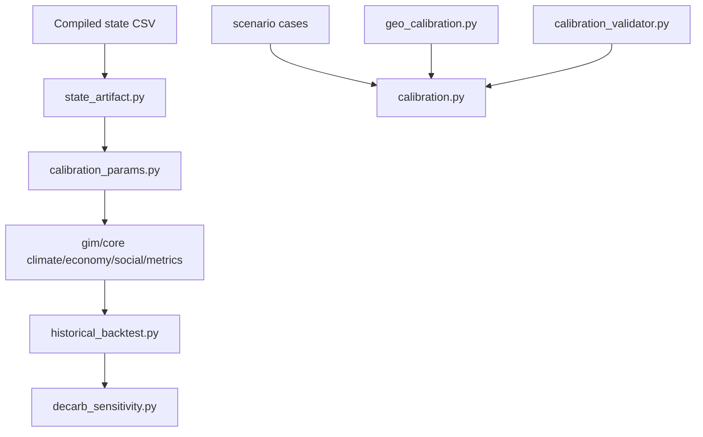

# GIM_14 Calibration Layer

This file describes how the executable calibration stack works inside `GIM_14`.

## 1. Layer Split

The calibration system is intentionally split into two passes.

### Pass 1: World Physics / Macro

Main files:

- [gim/core/calibration_params.py](/Users/theclimateguy/Documents/jupyter_lab/GIM_14/gim/core/calibration_params.py)
- [gim/core/state_artifact.py](/Users/theclimateguy/Documents/jupyter_lab/GIM_14/gim/core/state_artifact.py)
- [gim/core/country_params.py](/Users/theclimateguy/Documents/jupyter_lab/GIM_14/gim/core/country_params.py)
- [gim/historical_backtest.py](/Users/theclimateguy/Documents/jupyter_lab/GIM_14/gim/historical_backtest.py)
- [gim/decarb_sensitivity.py](/Users/theclimateguy/Documents/jupyter_lab/GIM_14/gim/decarb_sensitivity.py)

What it checks:

- GDP trajectory realism
- global CO2 realism
- temperature realism
- manifest-bound climate artifacts
- country fiscal priors
- structural decarb sensitivity

### Pass 2: Crisis / Political

Main files:

- [gim/geo_calibration.py](/Users/theclimateguy/Documents/jupyter_lab/GIM_14/gim/geo_calibration.py)
- [gim/calibration_validator.py](/Users/theclimateguy/Documents/jupyter_lab/GIM_14/gim/calibration_validator.py)
- [gim/calibration.py](/Users/theclimateguy/Documents/jupyter_lab/GIM_14/gim/calibration.py)
- [misc/calibration_cases/operational_v1](/Users/theclimateguy/Documents/jupyter_lab/GIM_14/misc/calibration_cases/operational_v1)

What it checks:

- scenario scoring stability
- dominant outcome plausibility
- driver overlap with historical intuition
- crisis dashboard behavior under known cases
- sanity bounds for geo weights and action shifts

## 2. Runtime Flow



## 3. Refresh Paths

Rebuild the primary state-artifact manifest:

```bash
cd /Users/theclimateguy/Documents/jupyter_lab/GIM_14
python3 misc/calibration/refresh_state_artifact_manifest.py
```

Rebuild historical backtest fixtures and restamp the primary manifest:

```bash
cd /Users/theclimateguy/Documents/jupyter_lab/GIM_14
python3 misc/calibration/refresh_historical_backtest_fixtures.py
```

These commands are the only safe path for changing:

- `EMISSIONS_SCALE`
- `DECARB_RATE_STRUCTURAL`
- bundled historical backtest baselines

## 4. Test Surface

Key calibration tests:

- [test_calibration_baseline.py](/Users/theclimateguy/Documents/jupyter_lab/GIM_14/tests/test_calibration_baseline.py)
- [test_climate_forcing.py](/Users/theclimateguy/Documents/jupyter_lab/GIM_14/tests/test_climate_forcing.py)
- [test_country_params.py](/Users/theclimateguy/Documents/jupyter_lab/GIM_14/tests/test_country_params.py)
- [test_state_artifact_binding.py](/Users/theclimateguy/Documents/jupyter_lab/GIM_14/tests/test_state_artifact_binding.py)
- [test_state_artifact_manifest.py](/Users/theclimateguy/Documents/jupyter_lab/GIM_14/tests/test_state_artifact_manifest.py)
- [test_historical_backtest.py](/Users/theclimateguy/Documents/jupyter_lab/GIM_14/tests/test_historical_backtest.py)
- [test_decarb_sensitivity.py](/Users/theclimateguy/Documents/jupyter_lab/GIM_14/tests/test_decarb_sensitivity.py)
- [test_calibration.py](/Users/theclimateguy/Documents/jupyter_lab/GIM_14/tests/test_calibration.py)
- [test_geo_calibration.py](/Users/theclimateguy/Documents/jupyter_lab/GIM_14/tests/test_geo_calibration.py)

## 5. Practical Command Set

Fast structural check:

```bash
cd /Users/theclimateguy/Documents/jupyter_lab/GIM_14
python3 -m unittest tests.test_calibration_baseline tests.test_climate_forcing tests.test_country_params -v
```

Artifact and contract check:

```bash
cd /Users/theclimateguy/Documents/jupyter_lab/GIM_14
python3 -m unittest tests.test_state_artifact_binding tests.test_state_artifact_manifest tests.test_state_csv_contract -v
```

Backtest and operational calibration:

```bash
cd /Users/theclimateguy/Documents/jupyter_lab/GIM_14
python3 -m unittest tests.test_historical_backtest tests.test_decarb_sensitivity tests.test_calibration -v
```

## 6. Current Working Interpretation

`GIM_14` should now be treated as the active repo for further calibration work, not just a migration shell.

The remaining work is no longer “port the calibration layer”; it is “continue calibrating on top of the restored layer.”
