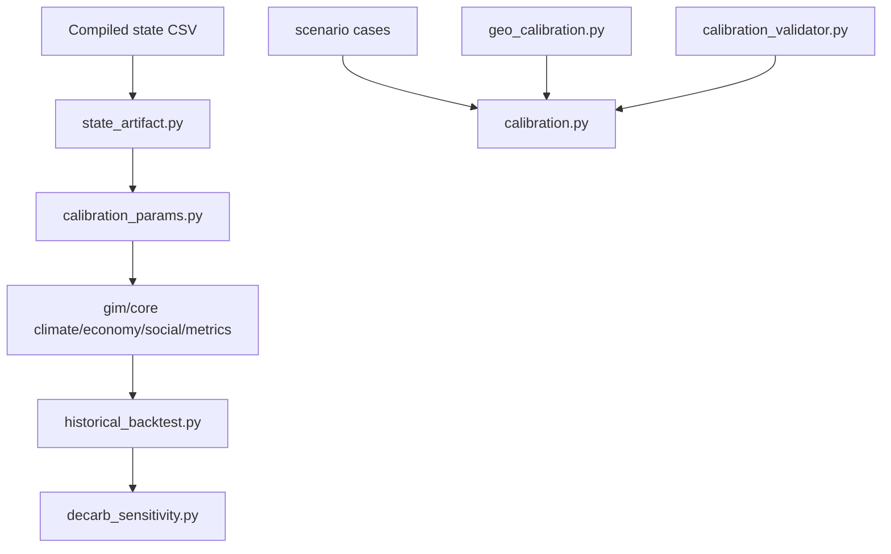

# GIM_14 Calibration Layer

This file describes how the executable calibration stack works inside `GIM_14`.

## 1. Layer Split

The calibration system is intentionally split into two passes.

### Pass 1: World Physics / Macro

Main files:

- [gim/core/calibration_params.py](/Users/theclimateguy/Documents/jupyter_lab/GIM_14/gim/core/calibration_params.py)
- [gim/core/state_artifact.py](/Users/theclimateguy/Documents/jupyter_lab/GIM_14/gim/core/state_artifact.py)
- [gim/core/country_params.py](/Users/theclimateguy/Documents/jupyter_lab/GIM_14/gim/core/country_params.py)
- [gim/historical_backtest.py](/Users/theclimateguy/Documents/jupyter_lab/GIM_14/gim/historical_backtest.py)
- [gim/decarb_sensitivity.py](/Users/theclimateguy/Documents/jupyter_lab/GIM_14/gim/decarb_sensitivity.py)

What it checks:

- GDP trajectory realism
- global CO2 realism
- temperature realism
- manifest-bound climate artifacts
- country fiscal priors
- structural decarb sensitivity

### Pass 2: Crisis / Political

Main files:

- [gim/geo_calibration.py](/Users/theclimateguy/Documents/jupyter_lab/GIM_14/gim/geo_calibration.py)
- [gim/calibration_validator.py](/Users/theclimateguy/Documents/jupyter_lab/GIM_14/gim/calibration_validator.py)
- [gim/calibration.py](/Users/theclimateguy/Documents/jupyter_lab/GIM_14/gim/calibration.py)
- [gim/sensitivity_sweep.py](/Users/theclimateguy/Documents/jupyter_lab/GIM_14/gim/sensitivity_sweep.py)
- [misc/calibration/calibrate_crisis_persistence.py](/Users/theclimateguy/Documents/jupyter_lab/GIM_14/misc/calibration/calibrate_crisis_persistence.py)
- [misc/calibration_cases/operational_v1](/Users/theclimateguy/Documents/jupyter_lab/GIM_14/misc/calibration_cases/operational_v1)
- [misc/calibration_cases/operational_v2](/Users/theclimateguy/Documents/jupyter_lab/GIM_14/misc/calibration_cases/operational_v2)

What it checks:

- scenario scoring stability
- dominant outcome plausibility
- driver overlap with historical intuition
- crisis dashboard behavior under known cases
- false-alarm resistance through stable `status_quo` controls
- multi-year debt and regime crisis persistence
- observation/reporting visibility through `competitive.crisis_flags`
- outcome-layer robustness under `+-20%` weight perturbations
- sanity bounds for geo weights and action shifts
- historical near-miss discrimination for debt / FX / political cases via `operational_v2`

## 2. Runtime Flow



## 3. Refresh Paths

Rebuild the primary state-artifact manifest:

```bash
cd /Users/theclimateguy/Documents/jupyter_lab/GIM_14
python3 misc/calibration/refresh_state_artifact_manifest.py
```

Rebuild historical backtest fixtures and restamp the primary manifest:

```bash
cd /Users/theclimateguy/Documents/jupyter_lab/GIM_14
python3 misc/calibration/refresh_historical_backtest_fixtures.py
```

Run the focused calibration helpers used in the latest climate/macro pass:

```bash
cd /Users/theclimateguy/Documents/jupyter_lab/GIM_14
python3 misc/calibration/calibrate_decarb_rate.py
python3 misc/calibration/calibrate_gamma_energy.py
python3 misc/calibration/calibrate_gamma_cross_section.py
python3 misc/calibration/calibrate_tfp_rd_share_sens.py
python3 misc/calibration/calibrate_heat_cap_surface.py
python3 misc/calibration/calibrate_temperature_variability.py
python3 misc/calibration/refresh_historical_backtest_baseline.py
```

Run the crisis-layer sensitivity sweep:

```bash
cd /Users/theclimateguy/Documents/jupyter_lab/GIM_14
python3 misc/calibration/sensitivity_sweep.py --out misc/calibration/geo_sensitivity_operational_v1.json
```

Run the near-miss discriminating sweep:

```bash
cd /Users/theclimateguy/Documents/jupyter_lab/GIM_14
python3 misc/calibration/sensitivity_sweep.py --suite operational_v2
```

Run the crisis persistence plateau search:

```bash
cd /Users/theclimateguy/Documents/jupyter_lab/GIM_14
python3 misc/calibration/calibrate_crisis_persistence.py
```

These commands are the only safe path for changing:

- `EMISSIONS_SCALE`
- `DECARB_RATE_STRUCTURAL`
- bundled historical backtest baselines

## 4. Test Surface

Key calibration tests:

- [test_calibration_baseline.py](/Users/theclimateguy/Documents/jupyter_lab/GIM_14/tests/test_calibration_baseline.py)
- [test_climate_forcing.py](/Users/theclimateguy/Documents/jupyter_lab/GIM_14/tests/test_climate_forcing.py)
- [test_country_params.py](/Users/theclimateguy/Documents/jupyter_lab/GIM_14/tests/test_country_params.py)
- [test_state_artifact_binding.py](/Users/theclimateguy/Documents/jupyter_lab/GIM_14/tests/test_state_artifact_binding.py)
- [test_state_artifact_manifest.py](/Users/theclimateguy/Documents/jupyter_lab/GIM_14/tests/test_state_artifact_manifest.py)
- [test_historical_backtest.py](/Users/theclimateguy/Documents/jupyter_lab/GIM_14/tests/test_historical_backtest.py)
- [test_decarb_sensitivity.py](/Users/theclimateguy/Documents/jupyter_lab/GIM_14/tests/test_decarb_sensitivity.py)
- [test_calibration.py](/Users/theclimateguy/Documents/jupyter_lab/GIM_14/tests/test_calibration.py)
- [test_geo_calibration.py](/Users/theclimateguy/Documents/jupyter_lab/GIM_14/tests/test_geo_calibration.py)
- [test_crisis_persistence.py](/Users/theclimateguy/Documents/jupyter_lab/GIM_14/tests/test_crisis_persistence.py)
- [test_sensitivity_sweep.py](/Users/theclimateguy/Documents/jupyter_lab/GIM_14/tests/test_sensitivity_sweep.py)

## 5. Practical Command Set

Fast structural check:

```bash
cd /Users/theclimateguy/Documents/jupyter_lab/GIM_14
python3 -m unittest tests.test_calibration_baseline tests.test_climate_forcing tests.test_country_params -v
```

Artifact and contract check:

```bash
cd /Users/theclimateguy/Documents/jupyter_lab/GIM_14
python3 -m unittest tests.test_state_artifact_binding tests.test_state_artifact_manifest tests.test_state_csv_contract -v
```

Backtest and operational calibration:

```bash
cd /Users/theclimateguy/Documents/jupyter_lab/GIM_14
python3 -m unittest tests.test_historical_backtest tests.test_decarb_sensitivity tests.test_calibration -v
```

## 6. Current Working Interpretation

`GIM_14` should now be treated as the active repo for further calibration work, not just a migration shell.

The remaining work is no longer “port the calibration layer”; it is “continue calibrating on top of the restored layer.”

Current climate/macro calibration interpretation:

- `DECARB_RATE_STRUCTURAL` is active at `0.052`, but its manifest now records an observed reference of `0.031241` over `2015-2023`
- `GAMMA_ENERGY = 0.07` now comes from a dedicated `2015` cross-sectional fit, because the bundled historical replay does not identify it over time
- `TFP_RD_SHARE_SENS = 0.5` is the active backtest-improving value and should be the starting point for the next econometric pass
- temperature is no longer treated as a purely deterministic fit target: `HEAT_CAP_SURFACE = 30.0`, the backtest deep-ocean anchor uses `T_surface - 0.60`, and natural variability is represented with `TEMP_NATURAL_VARIABILITY_SIGMA = 0.08`

Current crisis/political calibration interpretation:

- `operational_v1` is no longer a crisis-only suite; it now mixes `7` historical stress cases with `4` stable negative controls
- the stable controls are there to catch drift toward alarmist `status_quo` regressions, not to maximize criticality
- the outcome sensitivity sweep currently finds no pass/fail flips under `+-20%` perturbations on the outcome layer, which means the suite is robust but also that several weights remain only moderately identified
- crisis persistence is now backed by a dedicated Argentina / South Korea replay artifact rather than pure expert priors; the raw optimum is a broad plateau, and the committed values are the plateau candidate that also preserves the historical backtest golden anchor
