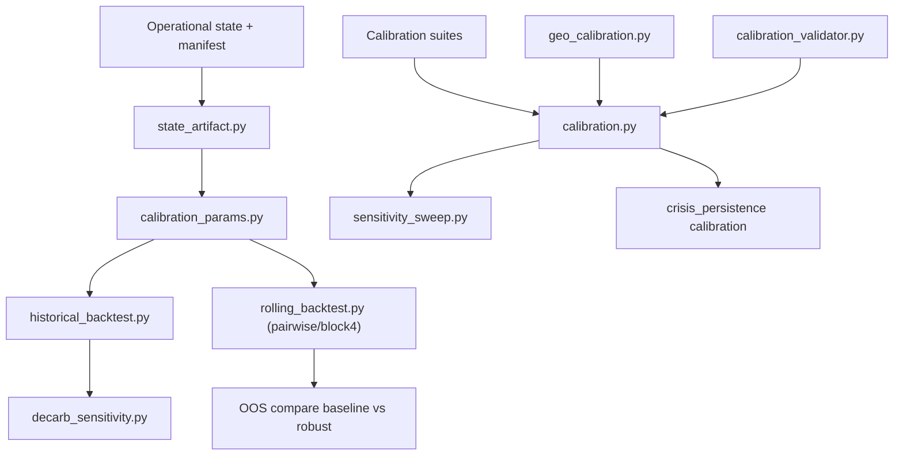

# GIM15 Calibration Layer

This document describes the executable calibration workflow in the current codebase.

## 1. Layer Structure

Calibration is split into three coupled passes.

### Pass A: Macro-climate structure

Core modules:

- `gim/core/calibration_params.py`
- `gim/core/state_artifact.py`
- `gim/historical_backtest.py`
- `gim/decarb_sensitivity.py`

Primary questions:

- does the `2015-2023` replay remain within GDP/CO2/temperature tolerances?
- are manifest-bound climate coefficients loaded correctly?
- do decarb alternatives degrade fit relative to the active artifact rate?

### Pass B: Crisis and geopolitical behavior

Core modules:

- `gim/geo_calibration.py`
- `gim/calibration_validator.py`
- `gim/calibration.py`
- `gim/sensitivity_sweep.py`
- `misc/calibration/calibrate_crisis_persistence.py`

Primary questions:

- do packaged cases keep expected dominant outcomes?
- are stable controls still `status_quo` under tuned weights?
- which outcome-layer weights are sensitivity hotspots?
- do debt/regime crisis durations stay in the tuned persistence corridor?

### Pass C: Rolling walk-forward validation

Core modules:

- `gim/rolling_backtest.py`
- `misc/calibration/run_rolling_origin_backtest.py`

Primary questions:

- do recalibrated parameters generalize on one-step out-of-sample windows?
- does a robust fixed parameter set outperform baseline on average OOS objective?
- are per-window gains stable (low variance) rather than concentrated in single years?

## 2. Runtime Data Flow



## 3. Artifact Ownership Rules

`EMISSIONS_SCALE` and `DECARB_RATE_STRUCTURAL` are artifact-bound:

- source of truth: `data/agent_states_operational.artifacts.json`
- load path: `gim/core/state_artifact.py`
- exposed in params: `gim/core/calibration_params.py`

Only refresh scripts should modify them:

```bash
python3 misc/calibration/refresh_state_artifact_manifest.py
python3 misc/calibration/refresh_historical_backtest_fixtures.py
```

## 4. Crisis Suite Semantics

- `operational_v1` is the broad regression suite (stress + controls).
- `operational_v2` is the near-miss discrimination suite.
- case files can be `.json` or `.yaml`.
- if a case defines `discriminating_weights`, sensitivity sweep defaults to that reduced weight set for the suite.

## 5. Standard Runbook

### Fast verification loop

```bash
python3 -m unittest \
  tests.test_historical_backtest \
  tests.test_decarb_sensitivity \
  tests.test_calibration \
  tests.test_crisis_persistence \
  tests.test_sensitivity_sweep -v
```

### Release validation package

```bash
./scripts/run_validation_package_v15.sh
```

### Operational suite checks

```bash
python3 -m gim calibrate --suite operational_v1
python3 -m gim calibrate --suite operational_v2
```

### Sensitivity outputs

```bash
python3 misc/calibration/sensitivity_sweep.py --suite operational_v1 --out misc/calibration/geo_sensitivity_operational_v1.json
python3 misc/calibration/sensitivity_sweep.py --suite operational_v2
```

### Persistence search

```bash
python3 misc/calibration/calibrate_crisis_persistence.py
```

### Rolling walk-forward

```bash
python3 misc/calibration/run_rolling_origin_backtest.py --stage pairwise --output-dir results/backtest/rolling_pairwise_2015_2023
python3 misc/calibration/run_rolling_origin_backtest.py --stage block4 --output-dir results/backtest/stage_bc_block4_2015_2023
```

## 6. Change Discipline

When changing calibration behavior:

1. update code and case fixtures
2. run the calibration tests
3. refresh generated artifacts if required
4. run rolling OOS comparison and save report artifacts
5. update `docs/CALIBRATION_REFERENCE.md` with new authoritative values
6. commit code + docs + artifacts together

This keeps the calibration layer reproducible and reviewable.
