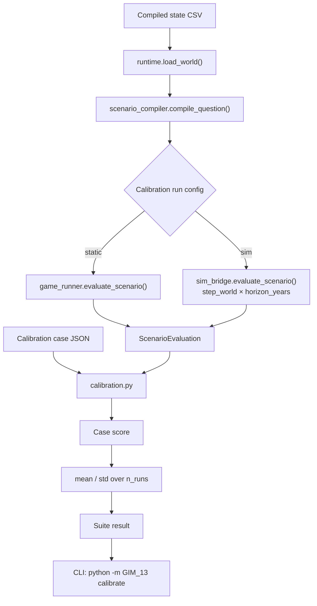

# GIM13 Calibration Layer

This document describes the current calibration layer implemented for `GIM_13`.

It is not a full scientific calibration framework yet. In its current form, it is an operational regression harness over bundled historical scenarios. That makes it useful for model iteration and guardrail checking, but not sufficient as proof of external validity.

## 1. Purpose

The current calibration layer exists to answer a narrow engineering question:

`When the model changes, do historically motivated scenarios still produce roughly the same qualitative pattern of outcomes, drivers, and crisis signals?`

It is therefore designed as:

- a repeatable operational check;
- a regression harness for the scenario layer;
- a compact scorecard over historically motivated cases;
- a way to surface where ranking logic changed after code or data updates.

It is not designed as:

- a full econometric calibration pipeline;
- a backtest over annual macro time series;
- a proof that the model is scientifically calibrated in the IAM sense.

That said, the repo now has a separate structural backtest path for macro and climate fit. The latest pass also introduces country-level fiscal priors in [country_params.py](/Users/theclimateguy/Documents/jupyter_lab/GIM_13/legacy/GIM_11_1/gim_11_1/country_params.py), with savings currently applied only as a downward correction to the pooled baseline so the legacy capital block does not overreact to high-saving economies before the dedicated econometric pass. The climate side now carries a simple calendar-anchored `non-CO2` forcing schedule, and `EMISSIONS_SCALE` is refreshed from the historical backtest fixture into the active artifact manifest instead of staying on the old free-floating normalization.

## 2. Role in the Stack



The calibration layer sits above the world loader and the scenario engine. In static mode it behaves like the original harness. In sim mode it delegates to `SimBridge` and therefore does run the yearly world dynamics through the vendored legacy core.

## 3. Current Artifacts

Implemented components:

- [calibration.py](/Users/theclimateguy/Documents/jupyter_lab/GIM_13/GIM_13/calibration.py)
- [operational_v1 suite](/Users/theclimateguy/Documents/jupyter_lab/GIM_13/GIM_13/calibration_cases/operational_v1)
- CLI entrypoint in [__main__.py](/Users/theclimateguy/Documents/jupyter_lab/GIM_13/GIM_13/__main__.py)
- regression tests in [test_calibration.py](/Users/theclimateguy/Documents/jupyter_lab/GIM_13/tests/test_calibration.py)

Current suite contents:

- `europe_sanctions_2022`
- `red_sea_maritime_2024`
- `taiwan_strait_2024`
- `middle_east_escalation_2024`
- `turkiye_fx_regime_2023`
- `argentina_debt_2023`
- `pakistan_instability_2023`

Default state for calibration:

1. [agent_states_gim13.csv](/Users/theclimateguy/Documents/jupyter_lab/GIM_13/GIM_12/agent_states_gim13.csv), if present
2. otherwise whatever `runtime.default_state_csv()` resolves to

## 4. Conceptual Design

The current calibration layer evaluates whether a scenario produces the expected qualitative shape across five axes:

1. top outcome
2. dominant outcomes set
3. strongest drivers
4. top crisis metrics by actor
5. internal quality floors

This is important: the layer does **not** calibrate coefficients directly. It scores outputs of the already-parameterized model against scenario expectations.

So the logic is:

```text
historical scenario description
-> compile question
-> evaluate scenario
-> compare actual outputs vs expected outputs
-> compute case score
-> aggregate across suite
```

## 5. Data Model

The layer is built around these typed objects from [calibration.py](/Users/theclimateguy/Documents/jupyter_lab/GIM_13/GIM_13/calibration.py):

| Object | Meaning |
| --- | --- |
| `CalibrationScenarioSpec` | Prompt, actors, template, base year, horizon |
| `CalibrationExpectationSpec` | Expected outcomes, drivers, actor metrics, and minimum score floors |
| `CalibrationCaseSpec` | Full bundled case spec loaded from JSON |
| `CalibrationRunConfig` | Runtime mode: static vs sim, `horizon_years`, `n_runs`, `default_mode` |
| `CalibrationCaseSnapshot` | Actual model outputs extracted from one evaluation |
| `CalibrationCaseResult` | Case-level mean score, `std_score`, notes, pass/fail, snapshot |
| `CalibrationSuiteResult` | Aggregated output over the whole suite |

## 6. Calibration Case Schema

Each case JSON has four logical blocks:

1. metadata
2. scenario definition
3. expectations
4. human-readable historical signals

Minimal shape:

```json
{
  "id": "example_case",
  "title": "Example case",
  "description": "Why this case exists",
  "reference_period": "2024-01 to 2024-12",
  "scenario": {
    "question": "Could ... ?",
    "template": "maritime_deterrence",
    "base_year": 2024,
    "horizon_months": 12,
    "actors": ["China", "Taiwan", "Japan", "United States"]
  },
  "expectations": {
    "top_outcomes": ["maritime_chokepoint_crisis"],
    "dominant_outcomes": [
      "maritime_chokepoint_crisis",
      "direct_strike_exchange",
      "broad_regional_escalation"
    ],
    "drivers": ["tail_pressure", "military_posture", "negotiation_capacity"],
    "actor_metrics": {
      "Taiwan": ["strategic_dependency", "oil_vulnerability", "regime_fragility"]
    },
    "min_calibration_score": 0.9,
    "min_physical_consistency_score": 0.9,
    "min_criticality_score": 0.58,
    "minimum_case_score": 0.72
  }
}
```

## 7. Scoring Logic

### 7.1 Extracted Outputs

For each evaluated scenario, the calibration layer extracts:

- `dominant_outcomes`
- top `4` drivers from `evaluation.driver_scores`
- top `3` crisis metrics per actor from `evaluation.crisis_dashboard`
- `calibration_score`
- `physical_consistency_score`
- `criticality_score`

Current hard limits in code:

```text
DEFAULT_TOP_DRIVER_LIMIT = 4
DEFAULT_TOP_METRIC_LIMIT = 3
```

### 7.2 Component Weights

Current case score weights are:

```text
top_outcome       = 0.30
dominant_outcomes = 0.25
drivers           = 0.20
actor_metrics     = 0.15
quality           = 0.10
```

So the layer is intentionally more sensitive to outcome ranking than to metric decoration.

### 7.2A Static vs Sim Mode

Current defaults:

- static mode: `n_runs=1`, `horizon_years=0`, `use_sim=False`
- sim mode: enabled with `--sim --horizon N`

In sim mode:

- each run compiles the same scenario;
- `SimBridge` builds the legacy policy map;
- `step_world(...)` is run for `horizon_years`;
- terminal `ScenarioEvaluation` is then scored against expectations.

### 7.3 Component Scoring

Top outcome:

```text
1.0 if actual top outcome is in expected top_outcomes
0.0 otherwise
```

Dominant outcomes, drivers, and actor metrics use overlap ratios:

```text
overlap_ratio = number_of_expected_items_found_in_actual_set / number_of_expected_items
```

Quality score is the share of passed internal floors:

```text
quality_score =
    passed_quality_checks / total_quality_checks
```

### 7.4 Total Case Score

Case score is the weighted sum:

```text
total_score =
    0.30 * top_outcome_score
  + 0.25 * dominant_outcome_score
  + 0.20 * driver_score
  + 0.15 * actor_metric_score
  + 0.10 * quality_score
```

A case passes only if both conditions hold:

```text
total_score >= minimum_case_score
and all quality floors pass
```

When multiple runs are requested, the layer aggregates results as:

```text
mean_score = mean(case_scores across runs)
std_score  = population_std(case_scores across runs)
```

In that case a case passes only if:

```text
mean_score >= minimum_case_score
and std_score < 0.15
and all mean quality floors pass
```

## 8. Quality Floors

Current internal quality gates are:

- `evaluation.calibration_score >= min_calibration_score`
- `evaluation.physical_consistency_score >= min_physical_consistency_score`
- `evaluation.criticality_score >= min_criticality_score`

This means a case can still fail even if the pattern match is decent, if the underlying scenario engine declares the result weak on calibration or consistency.

## 9. Suite Output

The suite returns:

- `case_count`
- `pass_count`
- `average_score`
- `average_calibration_score`
- `average_physical_consistency_score`
- `average_criticality_score`
- full list of `CalibrationCaseResult`

Text output is formatted by `format_calibration_suite_result(...)` in [calibration.py](/Users/theclimateguy/Documents/jupyter_lab/GIM_13/GIM_13/calibration.py).

CLI usage:

```bash
cd /Users/theclimateguy/Documents/jupyter_lab/GIM_13
python -m GIM_13 calibrate
```

JSON mode:

```bash
python -m GIM_13 calibrate --json
```

## 10. What This Layer Is Good For

This layer is good for:

- protecting the scenario engine from silent regressions;
- comparing two nearby model versions;
- checking whether refactors changed top outcome ranking;
- checking whether state rebuilds changed actor stress signatures;
- identifying where expectations drifted after data or scoring changes.

It is especially useful after:

- changing `agent_states_gim13.csv`
- editing `scenario_library.py`
- editing `game_runner.py`
- editing `crisis_metrics.py`

## 11. Why It Is Not Enough

This is the core limitation: the current layer is **case-based**.

That means it is vulnerable to exactly the concern you raised: cherry picking.

More concretely, the current layer:

- checks a hand-selected suite of scenarios;
- uses expectation-based overlap scoring;
- does not validate against large cross-country or longitudinal datasets;
- does not identify globally optimal coefficients;
- does not constrain the model outside the bundled scenarios.

So it should be read as:

`operational calibration harness`

not as:

`final model calibration methodology`

## 12. Boundaries

The current layer does not do any of the following:

- re-fit coefficients in `game_runner.py`
- re-fit weights in `crisis_metrics.py`
- optimize parameters over a target function
- backtest the yearly core over 2000-2025 time series
- recalibrate the world state build pipeline
- prove external validity of the model

It only scores outputs of the current model against a bundled expectation set.

Since `v13.1.3-dev`, the repo also includes a separate structural validation harness in [historical_backtest.py](/Users/theclimateguy/Documents/jupyter_lab/GIM_13/GIM_13/historical_backtest.py) and [test_historical_backtest.py](/Users/theclimateguy/Documents/jupyter_lab/GIM_13/tests/test_historical_backtest.py). That layer uses numeric RMSE targets over 2015-2023 GDP, global CO2, and temperature series and should be treated as the first concrete step toward the Level 1 validation path described below.

## 13. How To Evolve It Beyond Cherry Picking

If the goal is a stronger non-case-based calibration layer, the next step should be to split calibration into three levels.

### Level 1. Structural Calibration

Target the core state-transition engine:

- GDP growth
- inflation
- debt stress
- emissions
- energy/resource balances

This should use panel data and numeric error metrics such as MAE, RMSE, rank correlation, and direction-of-change hit rate.

### Level 2. Cross-Sectional Stress Calibration

Target the crisis layer across many countries in one year:

- inflation stress rankings
- FX stress rankings
- sovereign stress rankings
- regime fragility rankings

This should compare model ranks to external proxies, not hand-authored scenario narratives.

### Level 3. Scenario Regression Suite

Keep the current case suite, but reposition it as:

- regression protection
- archetype coverage
- sanity check for historical narratives

This is where the current calibration layer belongs.

## 14. Recommended Next Refactor

If you want to take this further without bloating the codebase immediately, the clean next move is:

1. Keep `calibration.py` as the operational regression harness.
2. Add a separate `validation/` layer for panel and cross-sectional numeric checks.
3. Treat the current JSON cases as `historical regression scenarios`, not as the main calibration truth.
4. Report both:
   - numeric validation metrics
   - scenario-regression pass rates

That gives a cleaner separation between:

- calibration of parameters,
- validation of outputs,
- regression protection for scenario behavior.

## 15. Practical Working Questions

If you are going to work on this layer next, the most productive questions are:

1. Which outputs should be calibrated numerically rather than narratively?
2. Which historical datasets can serve as broad targets for those outputs?
3. Which scenario cases are still useful as regression tests after that?
4. Which parameters are actually allowed to move in an operational tuning pass?

Those four questions should define the next iteration of calibration work much better than adding more case files.
